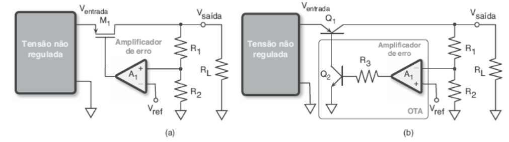
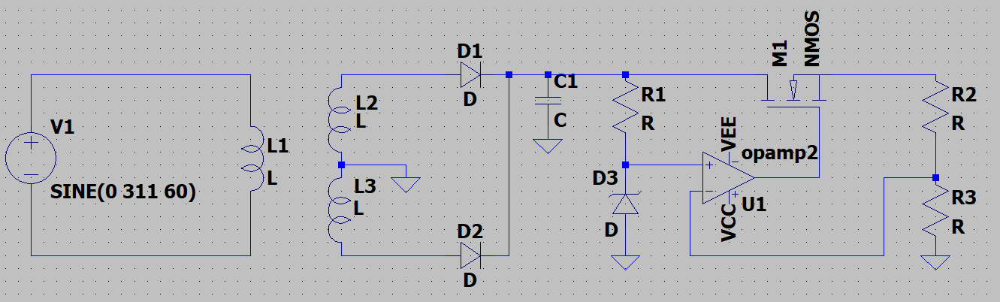
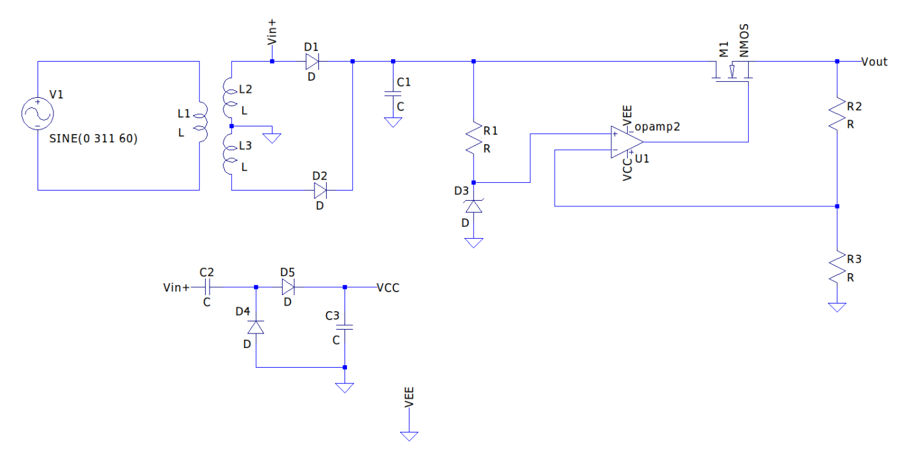
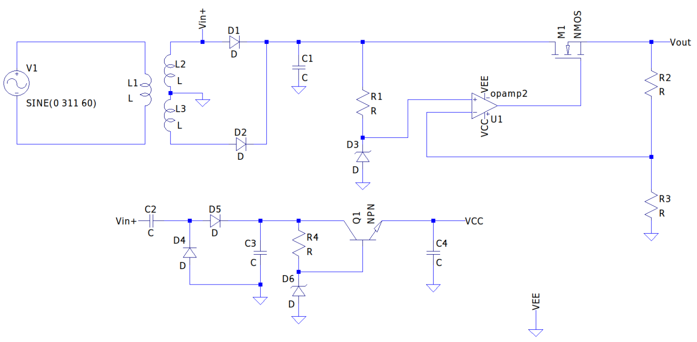
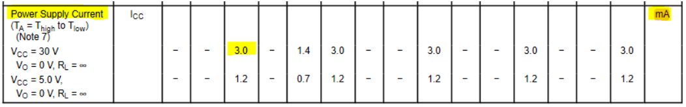
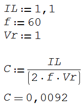

# Atividade 4 - Projeto final
Aluno: 
* Alexsander Vieira - <alexsander_vieira@hotmail.com>
 
Professor: 
* Daniel Lohmann
 
## Parte 01: Entendendo um regulador linear

### Princípios de regulação de tensão

    Os reguladores de tensão são blocos utilizados para regular/ajustar a tensão de saída de outros circuitos caso esta saída não corresponda à desejada. Este bloco é normalmente utilizado após uma etapa de retificação ou geração do circuito.  Seu objetivo é prover uma tensão com amplitude definida, idealmente sem que a carga aplicada ao circuito tenha grande efeito nesta tensão.

### Tensão de saída e tensão de ripple

    Conforme mencionado anteriormente o bloco regulador de tensão tem por objetivo prover uma tensão de valor específico com a menor variação possível, seja esta variação causada por uma alteração da carga ou por oscilações na tensão de entrada. A tensão de ripple é muito comum após as etapas de retificação do circuito, esta oscilação é decorrente do carregamento dos capacitores utilizados para filtrar a tensão de entrada, como estas oscilações podem acabar interferindo no funcionamento da carga ligada ao sistema, o bloco regulador também tem por objetivo remover ou minimizar o máximo este efeito.

### Regulação de linha

    Variação da tensão de saída causada pela variação na tensão de entrada, para uma dada corrente de carga. Seu valor é dado  pela fórmula: Regulação de linha = (delta Vout) / (delta Vin) [V/V].

### Regulação de Carga

    Variação  na tensão de saída causada pela variação na corrente de carga, para uma dada tensão de entrada. Seu valor é dado  pela fórmula:Regulação de carga = (delta Vout) / (delta Iout) [V/A].

### Conceito de LDO – Low Dropout Voltage

    De forma simples, o conceito de LDO visa obter uma baixa variação de tensão entre a entrada do bloco de regulação e a saída do circuito.
     
    Ao aplicar uma topologia LDO é possível obter uma queda de tensão no bloco regulador de  0,6-0,8 V, ou até menor. Assim minimizando muito a perda de potência nesta etapa.

    
     
    Exemplos LDO: (a) utilizando transistor MOS (b) utilizando transistor bipolar    

    Considerando o circuito da figura 01 que representa uma fonte linear com regulador MOSFET, temos o seguinte problema: Qual relação entre a tensão de alimentação do ampop e a tensão de saída? O que devemos considerar para esse circuito operar como um LDO? Como obter as tensões de alimentação para o AmpOp (VCC e VEE)?

    
     
    Figura 1    

#### Qual relação entre a tensão de alimentação do ampop e a tensão de saída?

    Conforme foi possível verificar durante os experimentos realizados na atividade 3, a tensão de alimentação do ampop acaba limitando a tensão de saída do mesmo devido a sua saturação, no caso do circuito apresentado o ampop precisa ser o suficiente para gerar o valor desejado na saída e ainda polarizar o MOSFET. Caso isso não seja feito corretamente, o circuito não funcionará conforme o desejado.

#### O que devemos considerar para esse circuito operar como um LDO?

    Para o circuito operar como LDO precisamos que  Vin seja ligeiramente maior ou igual a  Vout + VDO, onde VDO é a queda de tensão sobre o bloco regulador. Também é necessário garantir que o ampop possua tensão de alimentação suficiente para operar adequadamente, realizar a amplificação e polarizar o MOSFET, e com uma margem de segurança entre a tensão de saída e a tensão de saturação do mesmo.

#### Como obter as tensões de alimentação para o AmpOp (VCC e VEE)?

    A tensão de alimentação VCC deverá ser obtida através de um circuito externo e deve ser dimensionada de forma a proporcionar a tensão desejada na saída e tensão suficiente para polarizar o MOSFET, sendo assim acima de Vout.

#### Circuito proposto (01) para a alimentação do AmpOp:

    
        

#### Utilizando o circuito dobrador de tensão, qual valor de VCC você obtém para um sinal Vin+ de 12Vrms?

    O sinal Vin+ possui aproximadamente 16,97 V de pico, o que geraria uma tensão VCC de aproximadamente 32V, considerando a queda em cada diodo de 0,7V.

#### Quais problemas apresentam esse circuito? Podemos melhorar?

    O principal problema deste circuito é que ele não possui nenhuma etapa de filtro, o que devido ao ripple da etapa de retificação irá gerar uma oscilação do VCC do ampop. Outro ponto importante é que o circuito esta muito susceptível a uma oscilação de entrada, o que devido a amplificação do sinal poderia danificar o ampop utilizado no regulador linear da fonte. Para melhorar este sinal seria necessário adicionar uma um bloco regulador simples que possibilite remover o efeito do ripple sobre VCC.

#### Circuito proposto (02) para a alimentação do AmpOp:

    
        

#### Vamos projetar esse circuito de alimentação do AmpOp?

Considere:
* AmpOp LM324;
* MOSFET IRF540;
* VOUT = 15V;
* IOUT = 1A;
* vin+ = 12Vrms;
* vripple_pós_retificador =1V;
* Quedas de tensão nos diodos de 0,7V.
  
Pontos Importantes para iniciar o projeto responda justificando as escolhas.

#### Qual a Tensão VGS? Descreva como obter o valor.

   A tensão VGS é a tensão gate-source do MOS, portanto é a tensão de polarização deste transistor.
   Para o Vout de 15V e Iout de 1A (Iout=IDS), utilizando o datasheet do NMOS IR540, podemos verificar que a tensão de polarização necessária é de 4,5V.

   Logo:

   Saída do ampop U1 = 4,5 + 15 = 19,5 V

    
     Disponivel em: https://www.onsemi.com/pdf/datasheet/lm324-d.pdf   

#### Qual a tensão de alimentação do AmpOP?

   a tensão de alimentação max do ampop é de até 32 V de alimentação única, como precisamos de aproximadamente 20V (19,5V), utilizaremos uma alimentação única de 24V.

#### Qual fator devo considerar para escolher o transistor Q1?

   É necessário escolher um transistor que possua um hfe maior que 100 para que a corrente de alimentação da base desse bjt seja muito menor que a corrente do diodo zener

#### Qual valor da tensão do diodo zener D6?

   Como a tensão de alimentação escolhida foi de 24V, o zener escolhido deve ser de 24V.

#### Como escolher o diodo zener D6, maximizando a eficiência energética e minimizando os ruídos no circuito?

   Para maximizar a eficiência energética é necessário analisar a  resistência de zener. É necessário que a resistência de zener seja baixa para que a tensão de regulação do zener não varie mais que o desejado.

#### Considere que, por alterações futuras no circuito, o AmpOp poderá ter uma aumento de 10mA na corrente de alimentação, o circuito proposto continuará funcionando?

   Sim, devido a topologia utilizada esta alteração não deve impactar o funcionamento do circuito.

## Parte 02: Calculando e dimensionando os componentes

#### a) Para o primeiro bloco (D1, D2 e C1) considere vin+ = 12Vrms, vripple_pós_retificador = 1V e I_carga = 1,1A. Justifique a escolha dos componentes.

   Os diodos D1 e D2 devem proporcionar uma queda de tensão máxima 1 V e suportar uma dissipação de potência maior que 18,7W.

   Já o capacitor será escolhido com base na formula dp retificador de onda completa. Logo:

    
     

#### b) Circuito referência de tensão zener (R1 e D3):

#### Quais fatores devo considerar para escolher o diodo zener para essa aplicação?

   A tensão de zener deve ser definida considerando a Vout+VGS. Alem disso a resistência zener deve possuir um valor baixo para não interferir no circuito.

#### Qual a influência da regulação de linha e da regulação de carga para este circuito?

   Estes fatores vão definir a eficiência do bloco regulador. Sendo assim o circuito deve ser projetado visando uma regulagem de linha e carga próximos de zero.

#### Qual o impacto da regulação linha / carga do circuito com o diodo zener na tensão de saída do regulador linear?

   A regulação de linha mostra a capacidade da fonte de alimentação de manter a sua tensão de saída em face a variações na tensão de entrada.
   O diodo zener executará a função de  limitar a tensão de saída, de modo que a minimizar a variação de vout,. Logo temos que:
   Regulação de linha = (delta Vout) / (delta Vin) = (0) / (delta Vin) = 0 V/V
   A mesma relação se aplica ao regulador de carga, que mesmo ao variar a carga, Vout se mantém constante.
   Regulação de carga = (delta Vout) / (delta Iout) = (0) / (delta Iout) = 0 V/A

#### Podemos melhorar esse circuito? Quais problemas podemos identificar nesta topologia?

   Seria possível melhorar este circuito ao utilizar uma topologia que garantisse uma corrente constante sobre o zene, pois alterações neste ponto do circuito serão propagadas para a saída do sistema.

#### Seria possível melhorar a fonte e forma a deixar ela ajustável?

   Para deixar a fonte ajustável seria necessário adicionar um potenciômetro em paralelo com a tensão de referência na saída. Podemos também adicionar resistores em série com o potenciômetro, diminuindo a excursão de tensão do potenciômetro. Desta forma garantindo uma tensão de entrada no ampop mais estável.

#### c) Escolhendo o transistor M1 e calculando R2 e R3.

#### Qual a corrente contínua necessária?

   Por requisitos de projeto a corrente necessária é de 1 A, e um VGS de 4,5 V.

#### Quais os limites de tensão para este circuito?

   Os limites de tensão para esse circuito será a própria tensão da fonte retificada, que estará em 17V. A saída do ampop Vout que é especificada pelo projeto para 15V. Importante ressaltar que a tensão sobre o mosfet VGS será a tensão de saída do ampop menos Vout.

#### Ao escolher o transistor obtenha:

#### Quais os os parâmetros L, W, uo, Cox, VA e Vt?
* L = 100 uH
* W = 100 uW
* u0 = Valor Padrão = 600  cm²/V/s
* C0x = KP/u0 = 41,68 mF/m²
* VA = 1/LAMBDA= 1/0.00291031 = 343,61 v
* Vt = 3.56362 V

#### Calcule o valor de RDS para as tensões VGS de 2V, 3V, 4V, 5V e 10V

VGS[V] | Vt0[V]   | RDS teórico + (RS+RD)[ohms] 
------ | -------  | ---------------------------------------- 
2      | 3,56362  | infinito 
3      | 3,56362  | infinito 
4      | 3,56362  | 0,137 
5      | 3,56362  | 0,073 
10     | 3,56362  | 0,051 

#### Quais as tensões máximas de operação deste componente?

   A tensão VGS do IR540 não deve exceder +-20 V. VDS não pode exceder 100V.

#### Obtenha as curvas ID x VDS para esse componente para as tensões VGS de 2V, 3V, 4V, 5V e 10V e compare os resultados com as curvas presentes no Datasheet.

   Os valores obtidos via simulação estão de acordo com os valores disponíveis no datasheet.

RDS Simulação[ohms] | 
------ | 
4 Mega      |  
4 Mega     | 
0,156     |  
0,074      | 
0,051     | 

#### Qual o valor da capacitância de gate?

   CGS = Ciss - Crss = 1700p - 120p = 1580 pF típico

#### Justifique a escolha dos resistores R2 e R3.

   ...

