# Atividade 1
Aluno: 
* Alexsander Vieira - <alexsander_vieira@hotmail.com>

Professor: 
* Daniel Lohmann

## Exercício 1

Figura 1 - Exercício 1

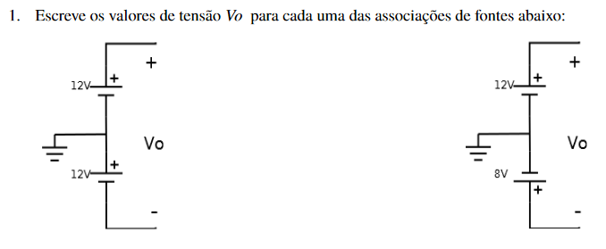

Figura 2 - Resposta Exercício 1

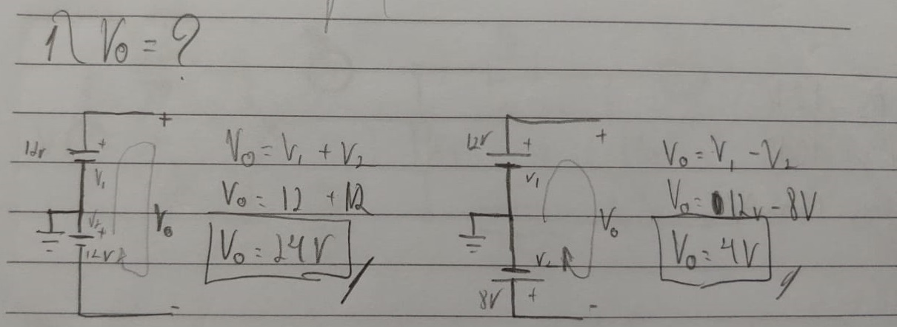

## Exercicio 2

Figura 3 - Exercício 2

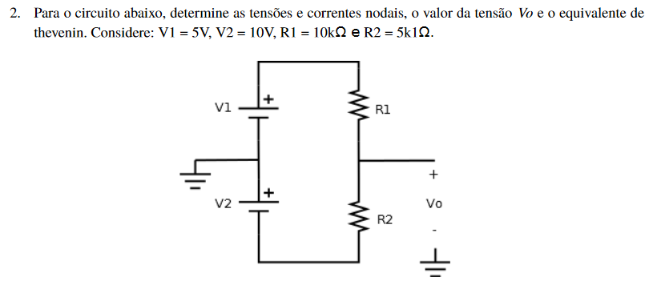

Figura 4 - Resposta Exercício 2

## Exercício 3

Figura 5 - Exercício 3

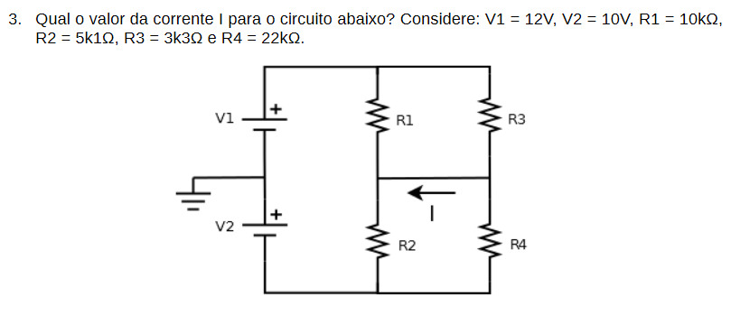

Figura 6 - Resposta Exercício 3

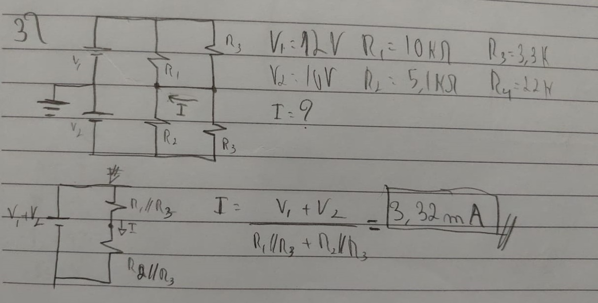

## Exercício 4

Figura 7 - Exercício 4

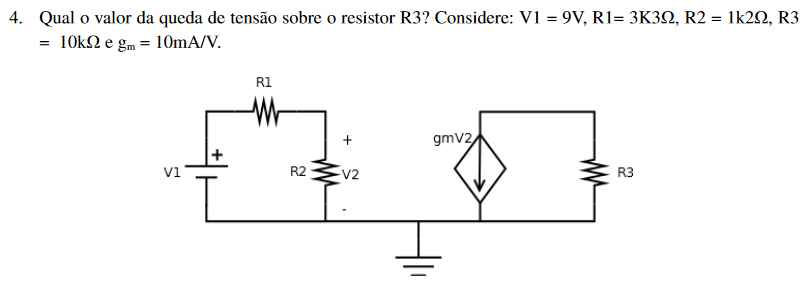

Figura 8 - Resposta Exercício 4

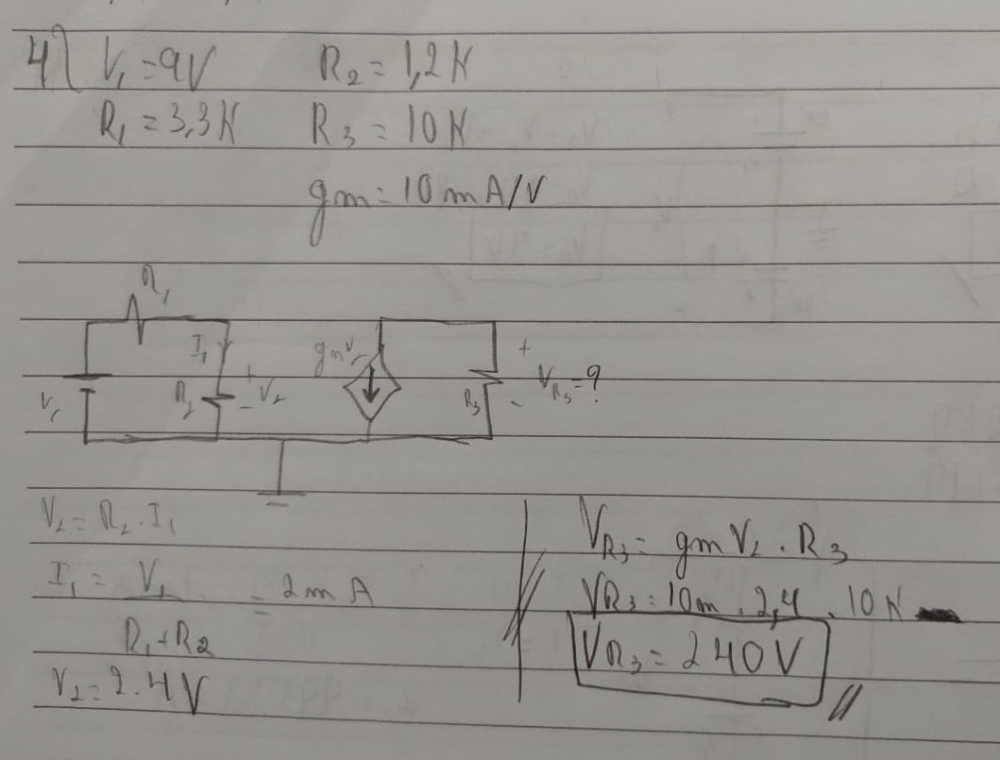

## Exercício 5

Figura 9 - Exercício 5

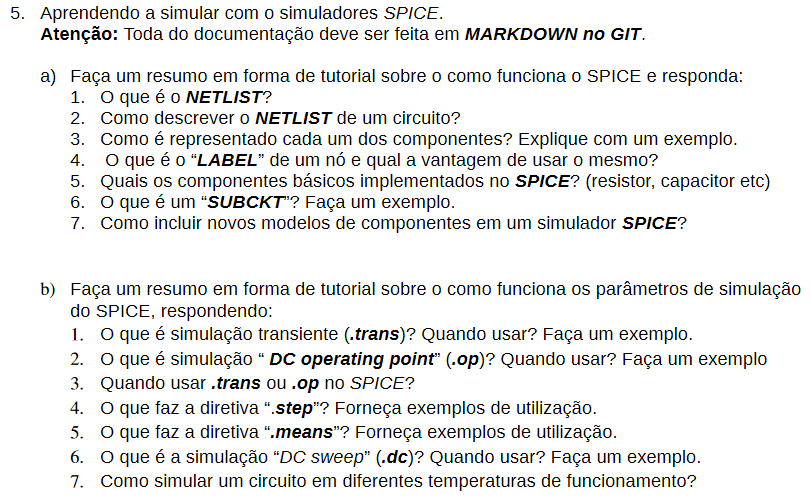

## a) Tutorial SPICE
Visão Geral
 
### Netlist
Netlist representa as conexões implementadas, estas são representadas na forma de texto. Neste texto temos o nome dos componentes, as suas posições e os seus valores.
Essas informações são necessárias pois a ferramenta analisa o circuito através do do metodo dos nós, sendo assim é desta forma que precisamos escrever o Netlist.
 
### Label
Label são etiquetas utilizadas para referenciar pontos específicos do circuito.
Ao trabalhar com circuitos mais complexos a utilização de Labels facilita muito a utilização e a compreensão do circuito analisado.
 
### Componentes básicos
O SPICE possui 4 componentes básicos, são eles, resistor, capacitor, indutor e diodo. O atalho para esses componentes são respectivamente R,C,L,D.
 
### Sub-circuitos (Subckt)
Subckt, são circuitos que são usados repetidamente, estes circuitos são transformados em modelos para facilitar a análise dos circuitos no SPICE.
Sub circuitos são normalmente utilizados para incluir modelos de componentes de empresas possibilitando uma simulação mais próxima do modelo real no SPICE.

### Criando um novos modelos de componentes no simulador SPICE
1. Abra o arquivo netlist que contenha as definições SPICE;
2. Clique com o botão direito sobre o arquivo do sub-circuito e pressione Create Symbol;
3. Clique em salvar.

## b) Simulação Spice
### .tran
Esta  é  realizada  para a observar o comportamento do circuito no domínio do tempo. Equivale à análise efetuada com o osciloscópio.

Figura 10 - Exercício 5

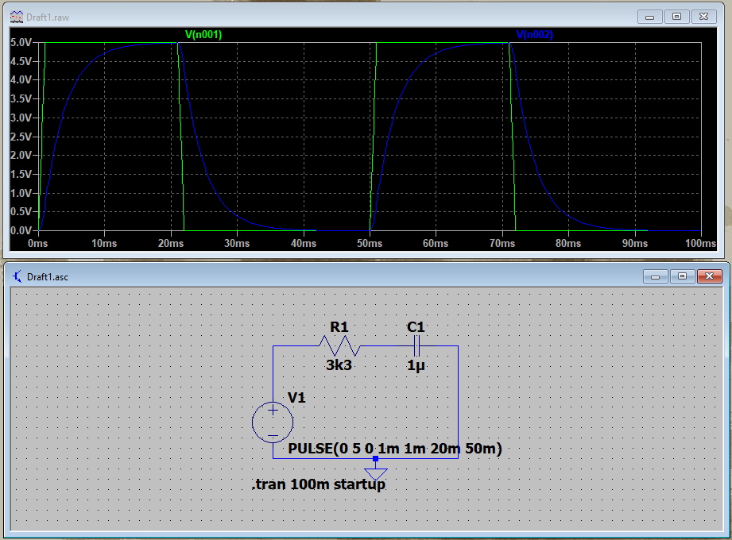

### .op
Este modo permite a análise das tensões e correntes de um circuito no modo DC é realizada considerando apenas a componente contínua.   
É utilizada para o estudo dos seguintes pontos fundamentais: 
- Ponto de Operação DC;
- Parametrização linearizada dos Modelos;
- Função de Transferência para pequenos sinais;
- Sensibilidade para pequenos sinais;
- Curvas de Transferência DC.

Figura 11 - Exercício 5

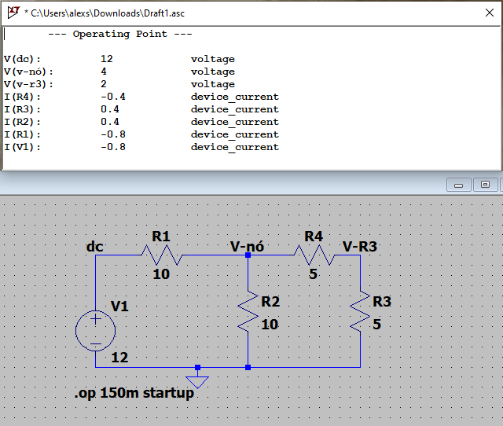

### .step
Permite realizar a simulação variando componentes do circuito.
Exe.: na figura o circuito é simulado alterando o valor de R1 de 1k até 10k.

Figura 12 - Exercício 5

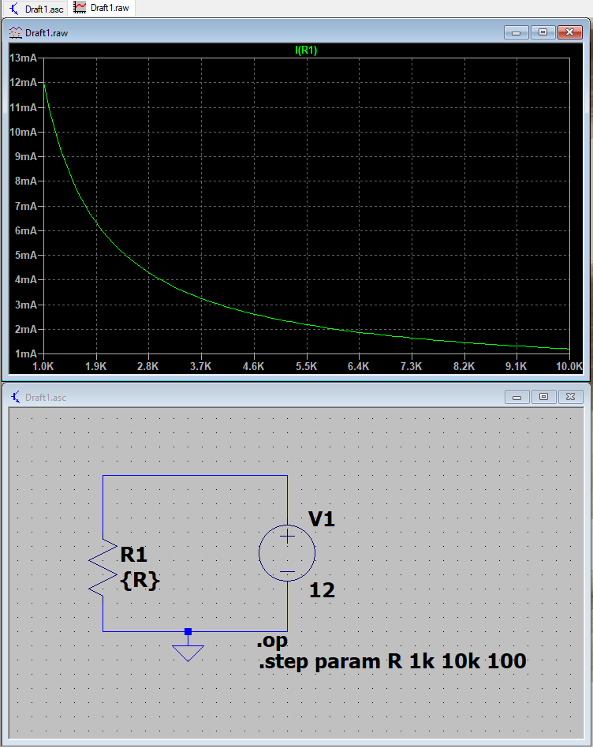

### .meas
Permite realizar medição de pontos especifucos.
Exe.: .meas TRAN res2 FIND (I(R1)*1000) WHEN V(VC)=3.

Figura 13 - Exercício 5

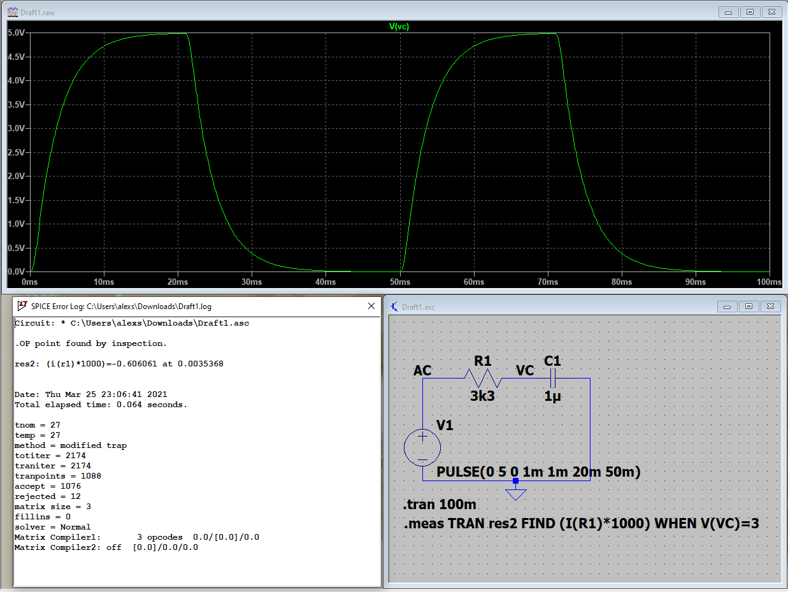

### .dc
.dc permite simular de forma parecida com .step, porem nesse caso são variados apenas os parametros de Tensão.

Figura 14 - Exercício 5

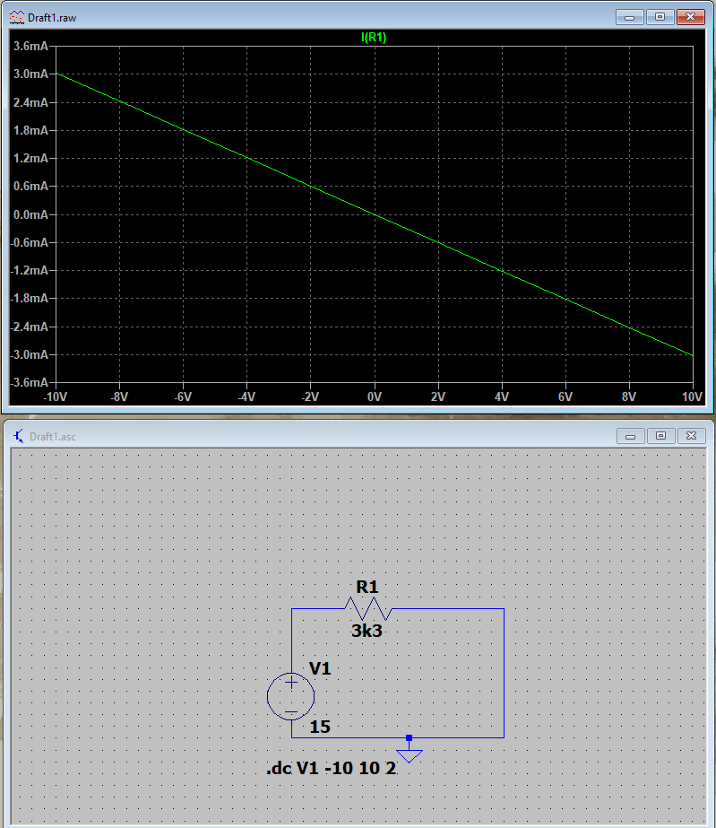

### .temp
Ao adicionar o parametro .temp é possivel simular o mesmo circuio em condições de temperatura selecionadas.
Exe.: .temp 10 20 30 40 50 60 70 80 90 100

Figura 15 - Exercício 5

