# Atividade 2
Aluno: 
* Gabriel Wagner - <gabrielstd545@gmail.com>

Professores: 
* Daniel Lohmann

## Exercício 1

### Amplificadores Operacionais
Os amplificadores operacionais são circuitos integrados capazes de realizar várias diversas funções, medição de tensões com isolamento elétrico, amplificação de sinais e operações aritméticas. O ampop oferece muitas outras opções dependendo do circuito empregado.
Seus terminais são: Entrada inversora, entrada não inversora, terminais de alimentação e saída.

### Ampop Ideal
Figura 0 - Ampop Ideal

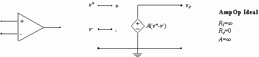

Referência: http://intranet.deei.fct.ualg.pt/AC/Sebenta_Online/www.isr.uc.pt/~paulino/cse/Sebenta_Online/cap_15/ampopid.htm

No ampop ideal as impedâncias de entrada são infinitas, ou seja, não entram correntes no ampop pelas entradas inversora e não inversora.
A impedância de saída é igual a zero. Isso significa que toda tensão da saída será aproveitada por uma provável carga.
O ganho do ampop ideal é infinito. Tomando pela equação do ampop ideal (V0 = A*(V+ - V_)), qualquer diferença de tensão entre as entradas inversora e não inversora resultará em uma tensão infinita na saída.

### Malha aberta
A malha aberta é uma configuração onde o ampop não apresenta realimentação, tanto positiva quanto negativa. O ganho nessa configuração apresenta um valor muito alto, teoricamente infinito.

### Malha fechada
A malha fechada é uma configuração onde o ampop apresenta realimentação, usualmente negativa. O ganho nessa configuração apresenta valores menores que em malha aberta.

### Cálculo de malha fechada

Os cálculos em malha fechada dependem muito dos reistores empregados, anteriormente tínhamos ganhos muito altos, teoricamente infinitos, mas na malha fechada isso não acontece.
Tomando como exemplo o amplificador inversor, temos que:

Figura 1 - Inversor.

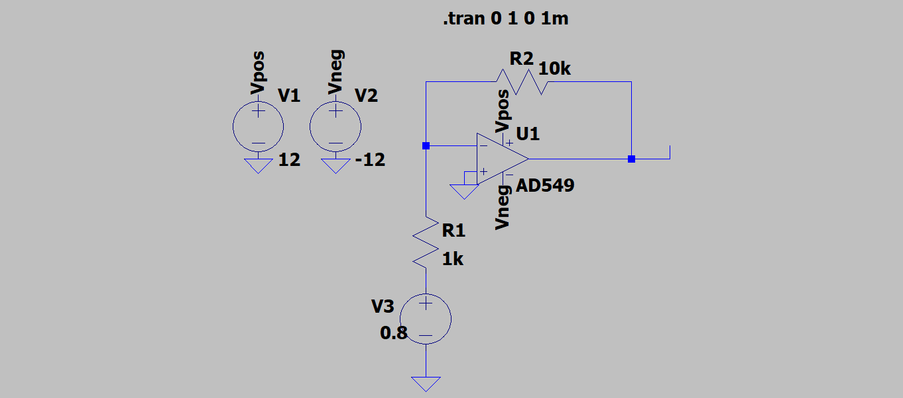

Vout = Av * (V+ - V-), no circuito inversor V+ = 0, então:

Vout = Av * (0 - V-).

Fazendo a malha de realimentação e passando o sinal de negativo para fora dos parênteses temos que:

Vout = - Av * (V3 + R1 * i).

Olhando para o circuito sabemos que a corrente neste nó é, i = (Vin - Vout) / (R1 + R2), substituindo i na equação, temos:

Vout = - Av * (V3 + R1 * (V3 - Vout) / (R1 + R2)).

Isolando Vout temos que:

Vout = - V3 * R2 / ((R1+R2)/Av + R1).

Perceba que se colocamos o ganho Av como infinito, como na malha aberta, voltamos para a equação original do ampop inversor:

Vout = -(R2/R1) * V3.

### Buffer

Figura 2 - Buffer.

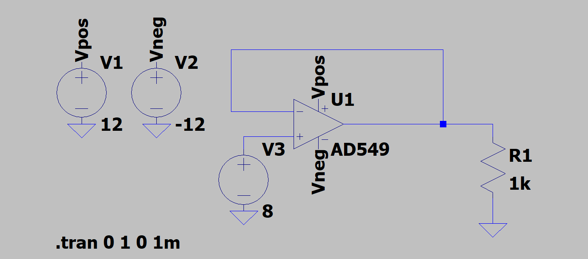

O buffer é uma implementação do ampop onde a tensão de entrada será a mesma tensão na saida. Muito utilizado quando você quer saber a tensão em uma parte do circuito, por exemplo em um resistor shunt, verificando assim a corrente naquela parte do circuito. A utilização do buffer para medição de tensão é muito interessante pois o ampop faz um isolamento elétrico entre ampop e circuito, pois a impedância de entrada do ampop é muito alta.

### Amplificador Inversor

Figura 3 - Inversor.

O amplificador inversor tem a função de amplificar ou atenuar o sinal de entrada, jogando uma tensão com sinal contrário na saída.

Vout = Ganho * Vin

Sendo o Ganho = -R2/R1, lembrando que R2 é o resistor na realimentação e R1 o resistor da tensão de entrada.

### Amplificador Não Inversor

Figura 4 - Não Inversor.

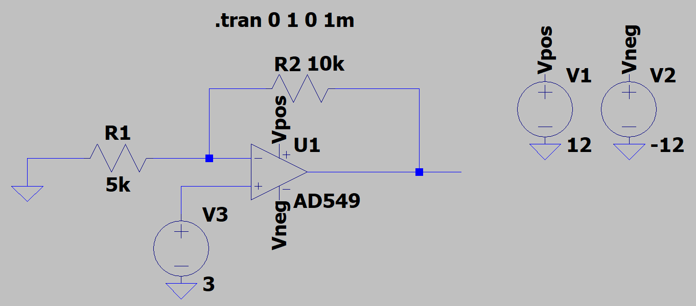

O amplificador não inversor tem a função de amplificar ou atenuar o sinal de entrada, jogando uma tensão com o mesmo sinal na saída.

Vout = Ganho * Vin

Sendo o Ganho = 1 + (R2/R1), lembrando que R2 é o resistor na realimentação e R1 o resistor ligado ao terra.

### Amplificador Somador Inversor

Figura 5 - Somador Inversor.

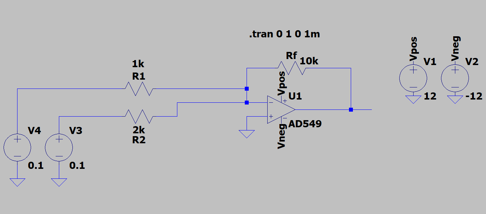

O amplificador somador inversor faz os somatórios das tensões que entram no terminal inversor, e libera esse resultado na saída.
O somador inversor segue a seguinte equação.

Vout = -RF * (V1/R1 + V2/R2 + V3/R3 ... Vn/Rn)

Conforme você vai adicionando mais sinais, a equação aumenta até n fontes e por conseguinte n resistores. 

### Amplificador Somador Não Inversor

Figura 6 - Somador Não Inversor.

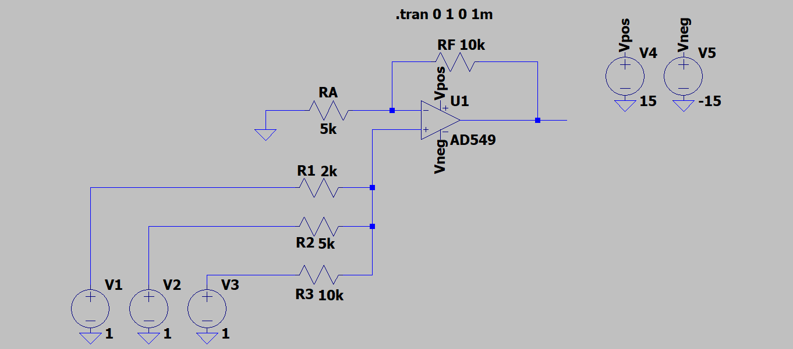

O amplificador somador não inversor faz os somatórios das tensões que entram no terminal não inversor, e libera esse resultado na saída.
O somador não inversor segue a seguinte equação.

Vout = (1 + RF/RA) * (V1/R1 + V2/R2 + V3/R3 ... Vn/Rn)

Conforme você vai adicionando mais sinais, a equação aumenta até n fontes e por conseguinte n resistores. 

### Subtrator

Figura 7 - Subtrator.

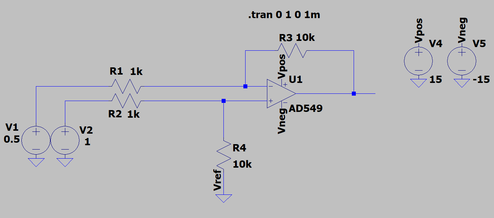

O ampop subtrator subtrai os sinais que entram nas saídas inversora e não inversora e joga essa tensão na saída, amplificado, atenuado ou de mesmo módulo.
A equação completa do subtrator é a seguinte:

Vout = (V1*(-R3/R1)) + (V2*(R4/(R2+R4)) * (1 + R3/R1)) + (Vref*(R2/(R2+R4)) * (1+(R3/R1)))

Como no nosso exemplo o Vref é igual a zero temos a seguinte equação:

Vout = (V1*(-R3/R1)) + (V2*(R4/(R2+R4)) * (1 + R3/R1)) + (0*(R2/(R2+R4)) * (1+(R3/R1)))
Vout = (V1*(-R3/R1)) + (V2*(R4/(R2+R4)) * (1 + R3/R1))

Fazendo a aproximação onde R1=R2 e R3=R4 temos a seguinte equação:

Vout = (V2 - V1) * (R3/R1)

Onde rapidamente se percebe que o ganho do subtrator é G = R3/R1

### Amplificador de Instrumentação

Figura 8 - Circuito com três ampops para instrumentação.

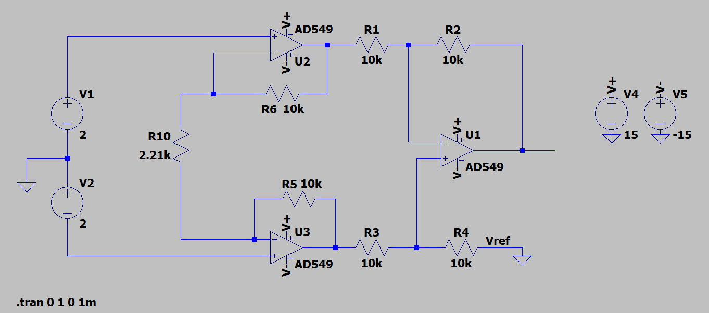

O circuito com ampops de instrumenação funciona como um subtrator com um inversor em cada entrada.
Devido aos inversores na entrada, a impedância de entrada tem valor altíssimo, diminuindo as correntes de entrada do circuito.
Além disso, o circuito apresenta uma grande atenuação do sinal de modo comum, ou seja alto CMRR, e apresenta também baixo offset.
Esse circuito é muito utilizado em equipamentos de medição e teste.

A equação que rege o amplificador de instrumentação com três ampops é a seguinte:

Vout = (V2 - V1) * Ganho + Vref. Sendo arbitrado Vref = 0.

O ganho para este circuito é Ganho = (R4/R3) * (1+((2 * R5)/R10)).

Por facilidade arbitramos os resistores de alimentação iguais, ou seja R5 = R6. Dando como exemplo o valor de 10K ohms. 
Para colocarmos o ganho de Vref = 1 V/V, mantendo um alto valor de CMRR, precisamos que R4 seja igual a R3, e R2 seja igual a R1.
Facilitando ainda mais a compra de componentes pode ser estabelecido valores iguais para todos os quatro resistores, por exemplo 10K ohms.
Percebe-se assim a necessidade de resistores de precisão, pois o menor descasamento afetaria as características do circuito.
Depois de estabelecermos os valores dos reistores, nota-se que somente R10 não foi escolhido, ele será o resistor que define o ganho deste circuito.

Se quisermos por exemplo um Ganho = 10V/V, R10 deve ser:

Ganho = (10k/10k) * (1+((2 * 10k)/R10)) = 10 V/V.

10 = (1+(20k/R10))

9 = 20k/R10

R10 = 2222.2 ohms.

### Ganho de malha aberto finito
Para demonstrar as diferenças deste ganho finito, compararemos o ganho nominal com o ganho em malha fechada do ampop inversor. Variaremos o ganho nominal de -1000 e -10 para o inversor e 1000 e 10 para o não inversor. Além disso, variaremos Av em 10000 e 100.

#### Inversor

erro = (|G| - (R2/R1)) / (R2/R1) * 100

Av | Módulo de (-R2/R1) | Módulo de G | Erro (%)
-- | ------------------ | ----------- | --------
10000 | 1000 | 909 | 9,1
100 | 1000 | 90,83 | 90,9
10000 | 10 | 9,98 | 0,2
100 |10 | 9,01 | 9,9

#### Não Inversor

erro = (G - (1+(R2/R1))) / (1+(R2/R1)) * 100

Av | 1+(R2/R1) | G | Erro (%)
-- | --------- | - | --------
10000 | 1000 | 909 | 9,1
100 | 1000 | 90,9 | 90,9
10000 | 10 | 9,99 | 0,1
100 |10 | 9,09 | 9,1

Para ambos os casos, percebe-se que conforme o valor de Av aumenta em direção ao ganho de malha aberta, menor o erro é.

### Tensão de modo comum (Vcm) e ganho em modo comum (Acm)
A tensão de modo comum, são as tensões idênticas em fase e módulo nas entradas inversoras e não inversoras. Você pode calcular essa tensão pela expressão:

Vcm = (Vin+ + Vin-)/2

A tensão de modo comum surge na saída amplificada por um ganho em modo comum, idealmente zero, como um acréscimo a diferença dos sinais de entrada. A expressão que rege essa soma de tensões é:

Vout = Ad * Vin + Acm * Vcm

Sendo Ad o ganho da diferença dos sinais e Acm o ganho em modo comum, predicial ao ampop.
Um dos problemas que a tensão de modo comum causa, é a limitação das tensões de entrada e saída, que serão faladas posteriormente.

### Razão da rejeição de modo comum (CMRR)
A razão da rejeição de modo comum é uma característica importantíssima do ampop, pois ela define a razão do ganho da diferença dos sinais das entradas inversora e não inversora pelo ganho da tensão de modo comum.

CMRR = Ad / Acm. 
Sendo Ad o ganho da diferença dos sinais e Acm o ganho da tensão de modo comum.
Lembramos que o ampop trabalha com a amplificação de sinais diferentes, então um alto CMRR é o ideal para o ampop. Podemos salientar também que quanto maior o ganho Acm, maior a tensão de modo comum, prejudicial para o ampop, significando por conseguinte um CMRR menor.

### Influência da tolerância dos resistores no CMRR
Para analisar o efeito do descasamento dos resistores, foi montado dois circuitos subtratores com ganho 1000 V/V. Os resistores de realimentação foram variados em uma taxa de 1% e 5%. Segue a montagem abaixo.

Figura 9 - Montagem dos dois subtratores.

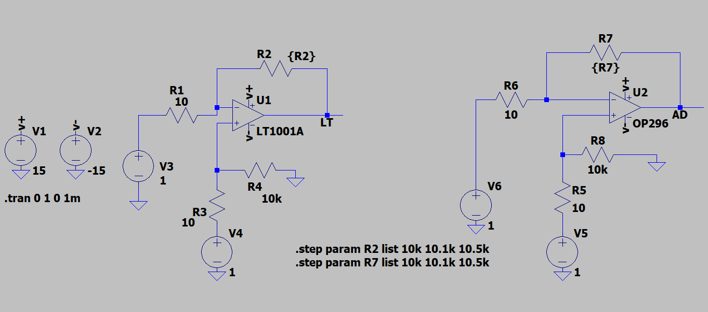

Com essa variação a tensão de saída de ambos ampops variou diferentemente.

Segue abaixo as tensões de saída do LT1001A e as tensões de saída do OP296:

Figura 10 - Tensões de saída do LT1001A.

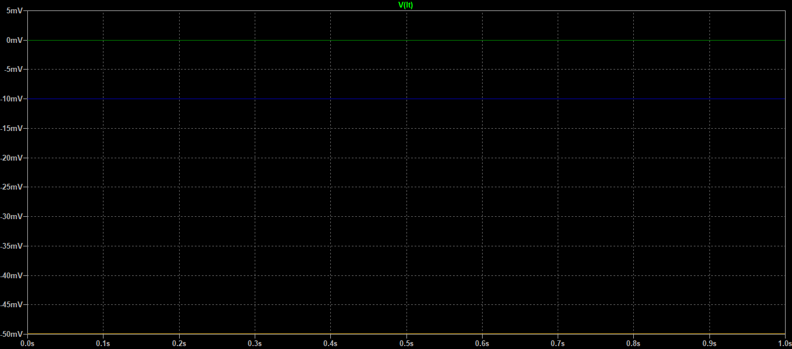

Figura 11 - Tensões de saída do OP296.

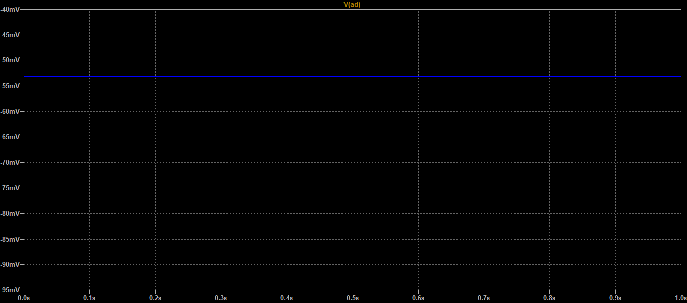

Percebe-se que o efeito do descasamento de resistores é maior no ampop OP296.

### Limitações das tensões de entrada e saída do ampop

Devido a tensão de modo comum e as oscilações das tensões de saída, que são problemas internos do ampop. Os amplificadores apresentam limitações nas tensões de entrada e saída.

Podemos observar através da imagem abaixo:

Figura 12 - Limitações de entrada e saída, training Texas Instruments.

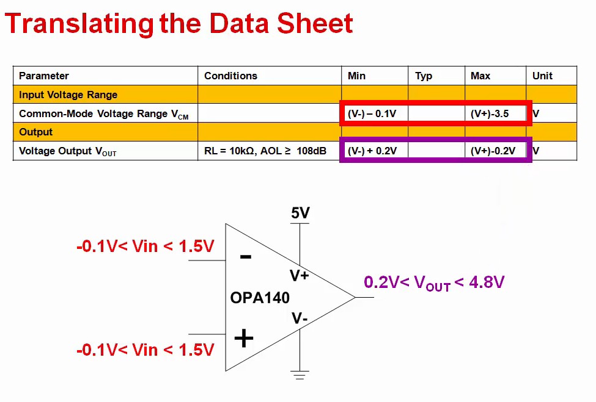

Referência: Training Texas Instruments; https://training.ti.com/ti-precision-labs-op-amps-input-and-output-limitations-non-linear-behavior

Observa-se que o ampop está sendo alimentado com 5V na alimentação positiva e 0V na negativa.
As tensões nas entradas inversora e não inversora serão limitadas por:

0-0,1 no limite inferior de tensão de entrada, e 5-3,5 no limite superior das tensões de entrada.

O mesmo acontece com as tensões de saída, com:

0+0,2 no limite inferior de tensão de saída, e 5-0,2 no limite superior das tensões de saída.

Tomando como exemplo o LM324 podemos encontrar rapidamente as limitações no datasheet. Como na imagem abaixo:

Figura 13 - Limitações de entrada e saída, LM324, Texas Instruments.

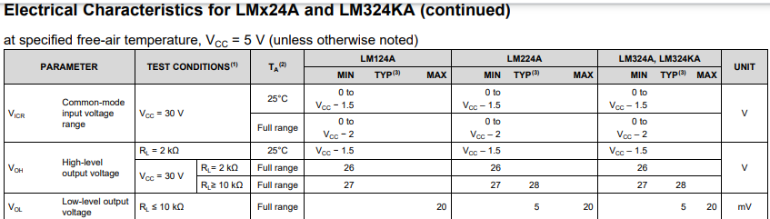

Referência: LM324; Texas Instruments; https://www.ti.com/lit/ds/symlink/lm324.pdf?ts=1608243756511&ref_url=https%253A%252F%252Fwww.ti.com%252Fproduct%252FLM324

O datasheet demonstra como em algumas condições você pode mitigar essas limitações. Dando como exemplo a escolha das tensões de alimentação e a resistência de carga que o ampop está trabalhando.

### Ampop Rail-to-rail
Ampops eram comumemte alimentados com alimentação única, VCC na alimentação positiva e 0V na alimentação negativa. Como demonstrado anteriormente, isso gerava uma baixa variação de tensões nas entradas e saídas, que são limitadas por problemas internos. Para aumentar a variação ou alcance das tensões de entrada foram construídos os ampops rail-to-rail, eles apresentam alimentação dupla e simétrica, com +VCC na alimentação positiva e -VCC na alimentação negativa. Essa característica diminui muitos as limitações de entrada e saída, além de problemas com ruído.

### Tensão de offset
A tensão de offset é definida como a tensão que deve ser aplicada aos dois terminais de entrada para se obter 0V na saída. Idealmente a tensão de saída devia ser zero quando as entradas recebem 0V, mas não é isso que acontece. A tensão de offset é modelada como uma pequena tensão de entrada em série com uma das entradas do ampop. Esse efeito ocorre devido a descasamentos dos transistores de entrada, durante a fabricação da matriz de silício dos transistores.
Dando como exemplo o ampop inversor, basta aterrar a entrada e ver a tensão de offset na saída. É importante lembrar que a tensão de offset estará multiplicada pelo ganho, e que uma tensão de saída negativa significará que a entrada positiva é aquela que apresenta o offset.

### Minimizando o offset
Podemos minimizar o offset colocando uma fonte de tensão de sinal contrário na entrada com offset.
Existem alguns ampops que apresentam um potenciômetro que deixa você ajustar a tensão de offset, mas essa característica é muito inviável na produção e venda em escala industrial. Recomenda-se comprar um ampop com baixo offset caso haja a necessidade.

### Temperatura x offset
A temperatura está muito relacionada com a tensão de offset. Como os transistores são componentes muito sensíveis a temperatura, o aumento ou diminuição dela, ocasiona o aumento ou diminuição do descasamento dos transistores de entrada, aumentando ou diminuindo o offset. Os ampops apresentam temperaturas de trabalho em seu datasheet, e os mais sensíveis apresentam curvas de tmperatura pelo offset como o gráfico abaixo.

Figura 14 - Temperatura x offset, Texas Instruments.

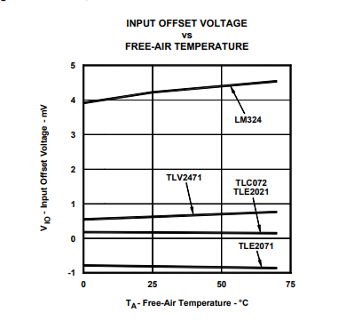

Referência: Dc parameters: input offset voltage; Texas Instruments; https://www.ti.com/lit/an/sloa059/sloa059.pdf?ts=1608267520346&ref_url=https%253A%252F%252Fwww.google.com%252F

### Correntes de polarização 
As correntes de polarização são correntes que podem sair ou entrar nas entradas do ampop, dependendo dos transistores de entrada. Elas são idealmente iguais, se anulando, mas na prática são diferentes. A diferença dessas correntes é a corrente de offset de entrada.
Quando a corrente de offset é pequena, um casamento das impedâncias de entrada pode cancelar a corrente de offset.
A corrente de polarização é dada pela seguinte equação:

IB = (IB1+IB2)/2

Sendo IB1 e IB2 as correntes em cada entrada.
Já a corrente de offset é dada pelo módulo da diferença das duas correntes.

IOS = |IB1 - IB2|

Alguns dos métodos de diminuição dessas correntes de polarização, consistem em medir a corrente de polarização e somar a ela outra corrente de mesmo módulo, mas com sinal contrário. Note que a soma não será exata, e uma corrente fluirá em algum dos dois sentidos.
Agora sabemos que existe uma corrente de entrada, que poderá gerar uma queda de tensão nas entradas. Tomando como exemplo a configuração inversora podemos colocar um resistor na entrada não inversora mitigando o problema.
Para efeitos de cálculo chamaremos RR como resistor de realimentação, R1 resistor na entrada inversora e R3 o resistor a ser achado, na entrada não inversora.
Além disso IB2 a corrente na entrada não inversora e IB1 a corrente na entrada inversora.

A tensão na saída nessa configuração será:

Vout = -IB2 * R3 + R2* (IB1-((IB2* R3)/R1))

Considerando as correntes de entradas iguais temos:

Vout = Ib * (R2 - R3* (1+(R2/R1)))

Podemos considerar Vout igual a zero, já que o objetivo de colocar o resistor na entrada não inversora, é mitigar tensões de entrada que resultarão em tensões na saída. Então temos:

R3 = R2/(1+(R2/R1) = (R1* R2) / (R1+R2)

Rapidamente se percebe que R3 deve ser igual a associação paralela entre R1 e R2, ou seja, o resistor de realimentação e o resistor da entrada inversora.

Avaliando as correntes finitas, seguindo as seguintes equações:

IB1 = IB + (IOS/2) e 

IB2 = IB - (IOS/2)

Podemos susbtituir na equação logo acima -> Vout = Ib * (R2 - R3* (1+(R2/R1)))

Então teremos que:

Vout = IOS * R2

Sendo assim R2 muito menor do que o seu valor sem a adição de R3.
Por fim, chegamos a conclusão que devemos adiconar um resistor na entrada não inversora, de valor igual a resistência cc vista pelo terminal inversor, desta maneira diminuindo os efeitos das correntes de polarização nas entradas

