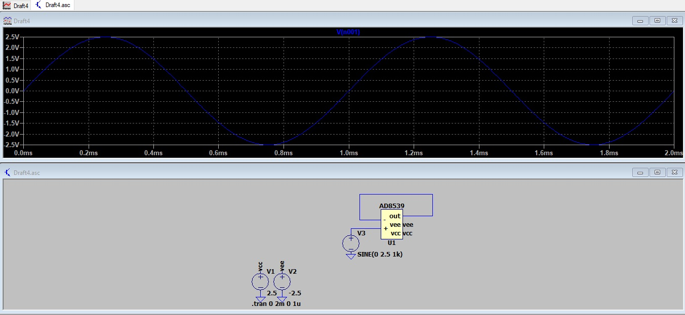
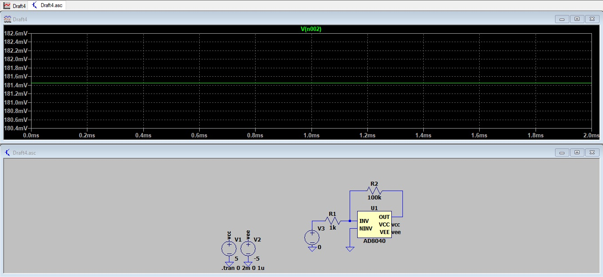
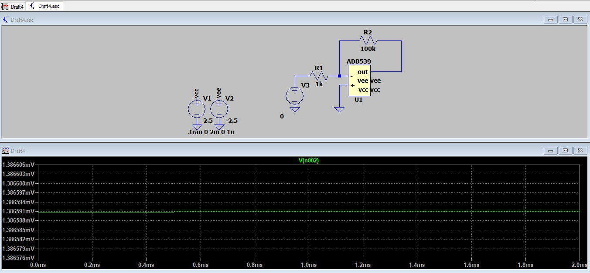
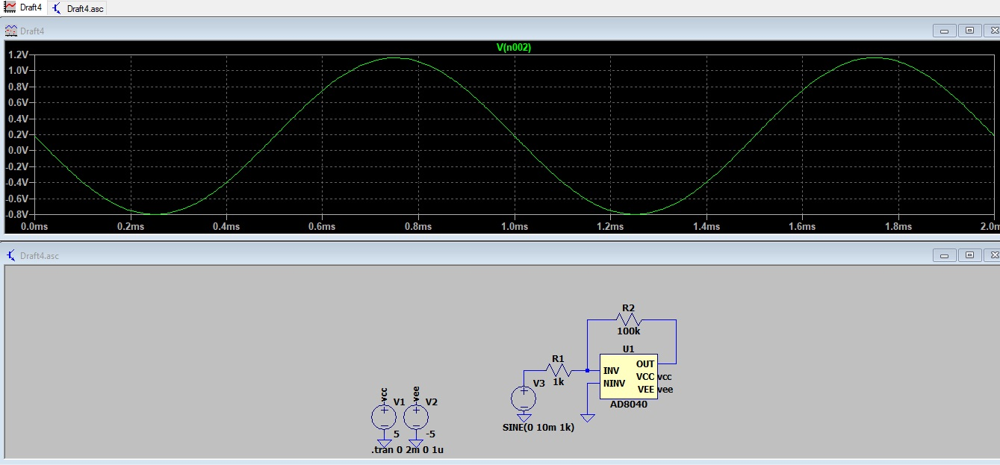
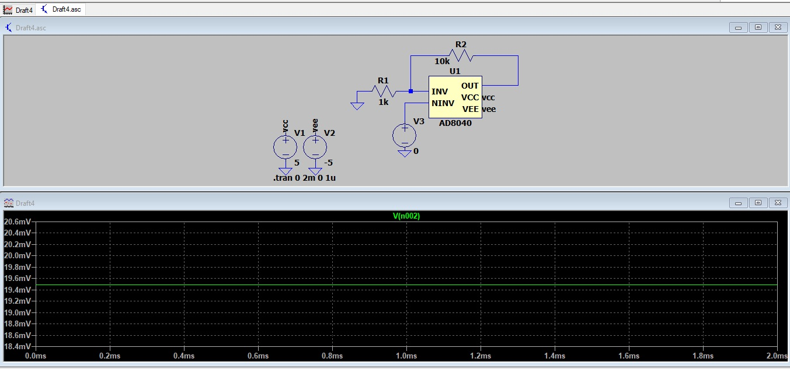
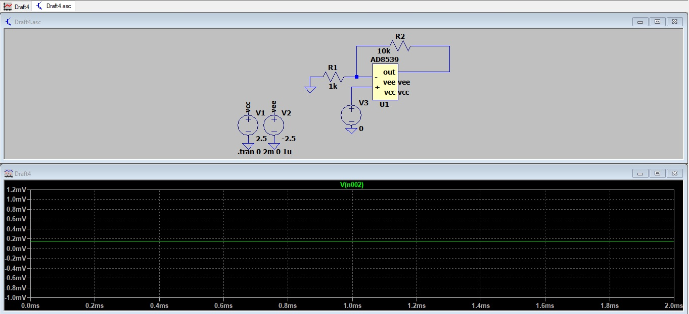
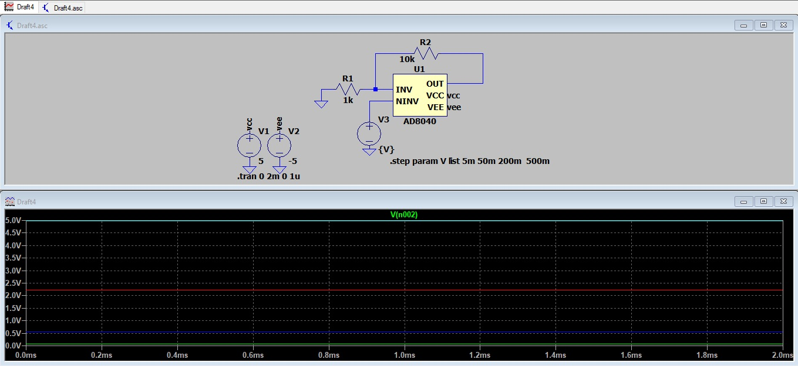
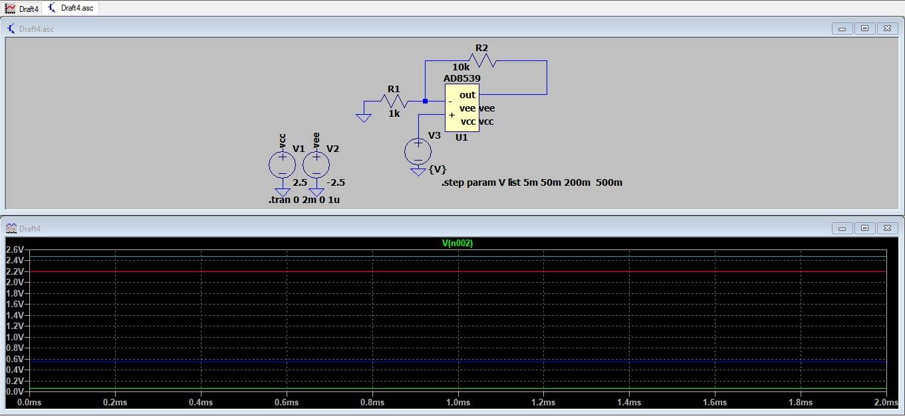

# Atividade 3
Aluno: 
* Gabriel Wagner - <gabrielstd545@gmail.com>

Professores: 
* Daniel Lohmann

## Parte 1

Visualização das características dos ampops AD8040 e AD8539.

## Parte 2

Figura 1 - Buffer AD8040 com sinal 5Vpp senoidal de 1kHz.

Figura 2 - Buffer AD8539 com sinal 5Vpp senoidal de 1kHz.

Percebe-se que ambas as saturações apresentam os valores de alimentação, +-5V e +-2,5V respectivamente.

## Parte 3

Figura 3 - Inversor AD8040 com sinal 0V e ganho -100 V/V.

Mesmo fornecendo 0V na entrada inversora, temos +181,5 mV na saída. Isso ocorre devido a tensão de offset do amplificador, podemos verificar o efeito do offset em relação ao valor do datasheet da seguinte forma.

No datasheet o maior valor típico do offset do AD8040 é 1,6 mV. Como a tensão de offset está funcionando na configuração não inversora, mesmo no circuito inversor, temos:

Vout = Vin*(1 + R2/R1)
Vout = 1.6m * 101 = 161,6 mV

O valor calculado está de acordo com a simulação.

Figura 4 - Inversor AD8539 com sinal 0V e ganho -100 V/V.

O efeito do offset aparece novamente. Dessa vez com o valor máximo do datasheet. 

1,3u * 101 = 1,3 mV

Figura 5 - Inversor AD8040 com sinal senoidal de 10mVpp@1kHz e ganho -100 V/V.

O valor está deslocado 200 mV do valor correto, tanto para o pico positivo quanto negativo. Esse efeito está descrito no datasheet.

Figura 6 - Inversor AD8539 com sinal senoidal de 10mVpp@1kHz e ganho -100 V/V.

O valor da simulação está de acordo com o valor calculado.

## Parte 4

Figura 7 - Não Inversor AD8040 com sinal 0V e ganho 10 V/V.

Figura 8 - Não Inversor AD8539 com sinal 0V e ganho 10 V/V.

A tensão de offset aparece novamente em ambas as simulações. Sendo o efeito mais perceptível no AD8040.

Figura 9 - Não Inversor AD8040 com sinais de 5mV, 50mV, 200mV e 500mV e ganho 10 V/V.

Tabela 1 - Erro da Tensão de saída calculada x simulação do ampop AD8040.

Vin(V) | Vout teórico(v) | Vout simulação(V) | Erro (%)
-- | ------------------ | ----------- | --------
5m | 50m | 74,4m | 48,8
50m | 500m | 568m | 13,6
200m | 2 | 2,214 | 10,7
500m | 5 | 5 | 0

Figura 10 - Não Inversor AD8539 com sinais de 5mV, 50mV, 200mV e 500mV e ganho 10 V/V.

Tabela 2 - Erro da Tensão de saída calculada x simulação do ampop AD8539.

Vin(V) | Vout teórico(v) | Vout simulação(V) | Erro (%)
-- | ------------------ | ----------- | --------
5m | 50m | 55m | 10
50m | 500m | 550m | 10
200m | 2 | 2,2 | 10
500m | 5 | 2,478 | 50

Obs. O erro de 50% na última linha do AD8539 se deve a saturação do sinal, pois as tensões de alimentação desse ampop são de +-2,5 v.

Podemos perceber alguns detalhes, o erro do ampop AD8040 aumenta conforme diminuímos as tensões de entrada. Grande parte devido a tensão de offset, que têm uma grandeza de tensão na ordem de mV.

Outro detalhe é que o erro ao ampop AD8539 é mais equilibrado, apresentando valores constantes com regularidade.

