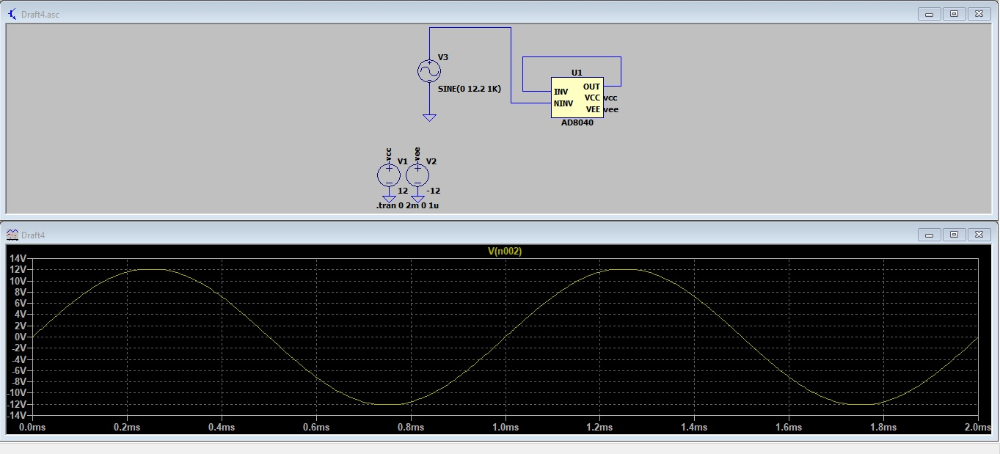
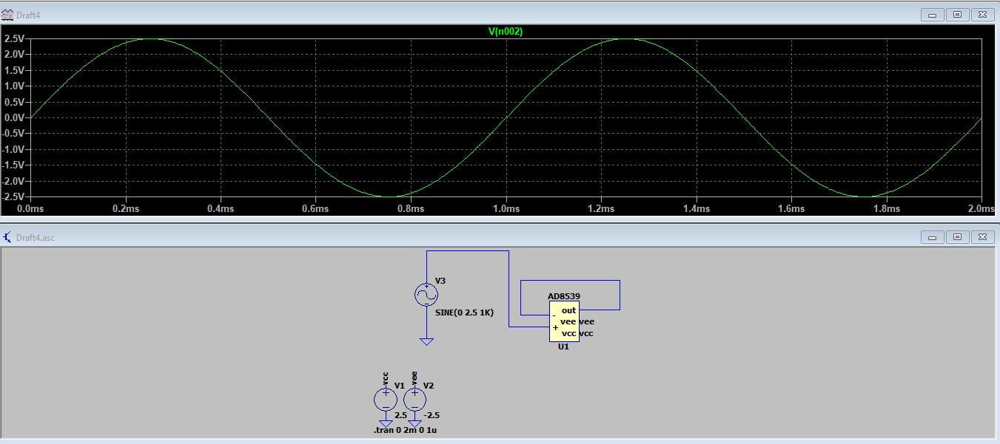
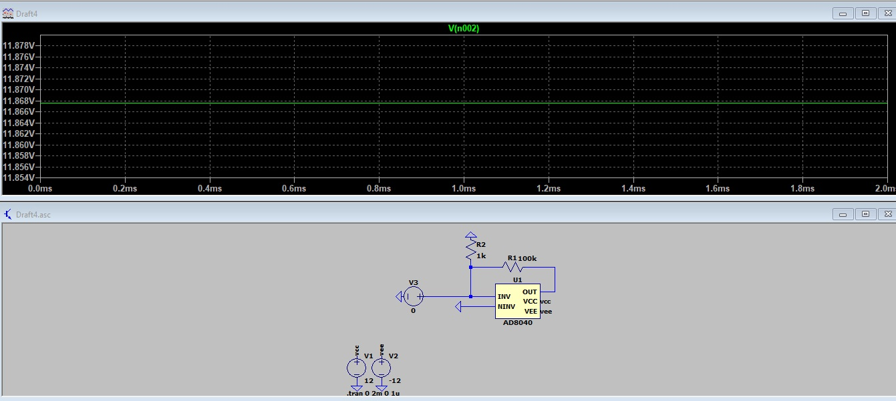
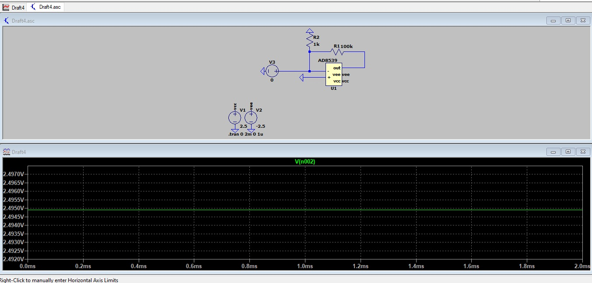
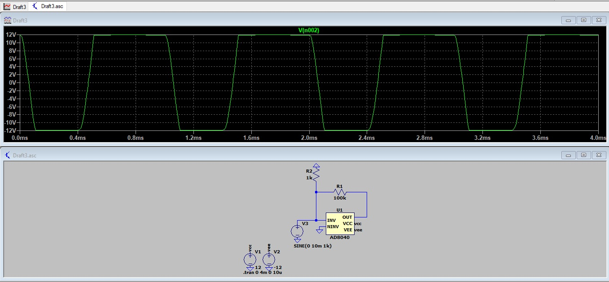
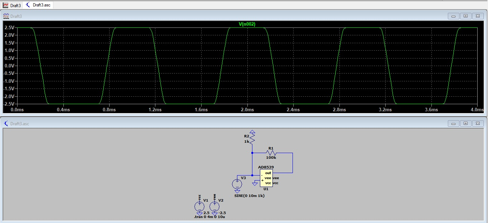
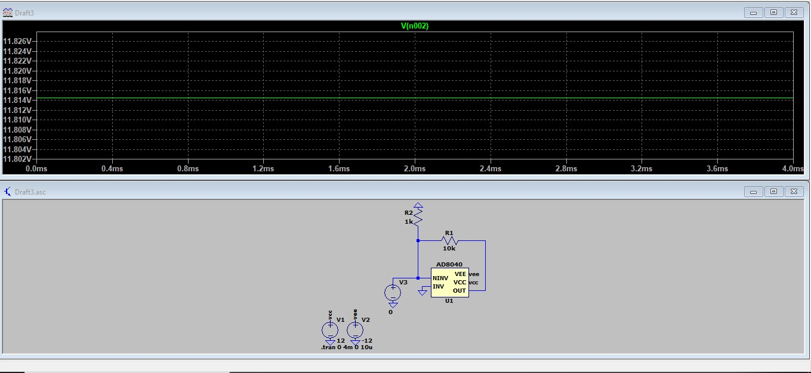
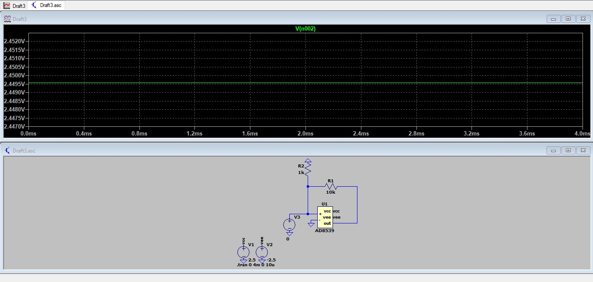
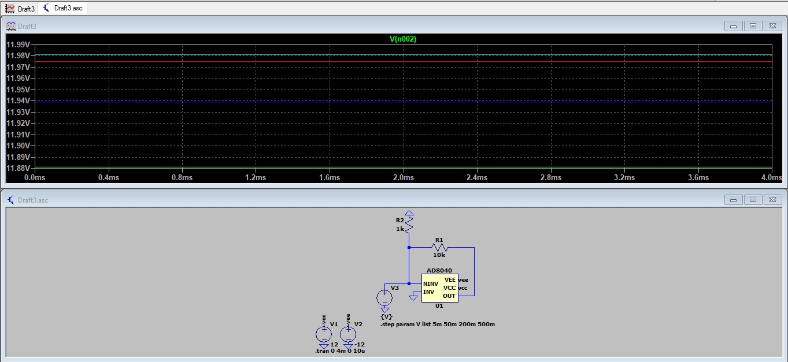
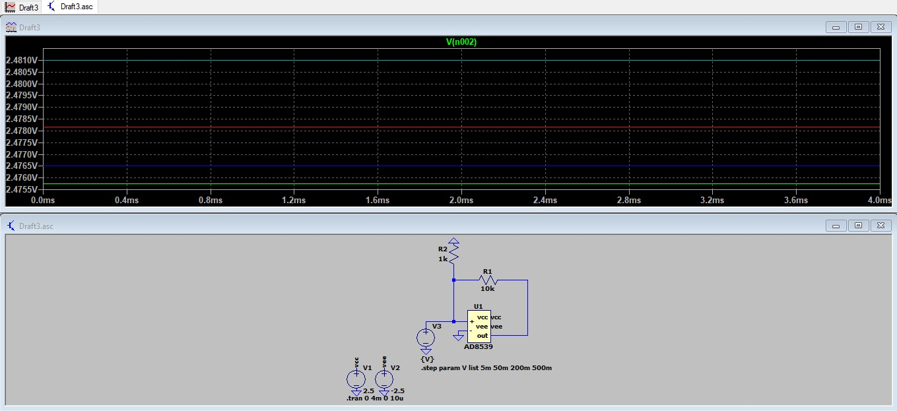

# Atividade 3
Aluno: 
* Gabriel Wagner - <gabrielstd545@gmail.com>

Professores: 
* Daniel Lohmann

## Parte 1

Visualização das características dos ampops AD8040 e AD8539.

## Parte 2

Figura 1 - Buffer AD8040 com sinal 0Vpp senoidal de 1kHz.

Figura 2 - Buffer AD8539 com sinal 0Vpp senoidal de 1kHz.

## Parte 3

Figura 3 - Inversor AD8040 com sinal 0V e ganho -100 V/V.

Figura 4 - Inversor AD8539 com sinal 0V e ganho -100 V/V.

Figura 5 - Inversor AD8040 com sinal senoidal de 10mVpp@1kHz e ganho -100 V/V.

Figura 6 - Inversor AD8539 com sinal senoidal de 10mVpp@1kHz e ganho -100 V/V.

## Parte 4

Figura 7 - Não Inversor AD8040 com sinal 0V e ganho 10 V/V.

Figura 8 - Não Inversor AD8539 com sinal 0V e ganho 10 V/V.

Figura 9 - Não Inversor AD8040 com sinais de 5mV, 50mV, 200mV e 500mV e ganho 10 V/V.

Figura 10 - Não Inversor AD8539 com sinais de 5mV, 50mV, 200mV e 500mV e ganho 10 V/V.

