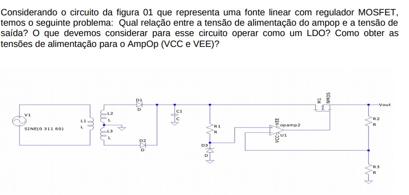
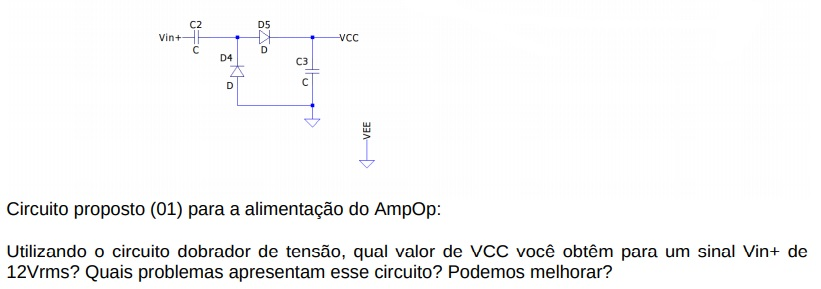
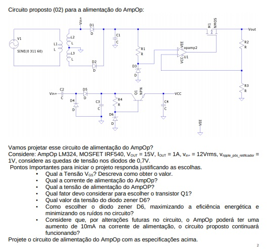
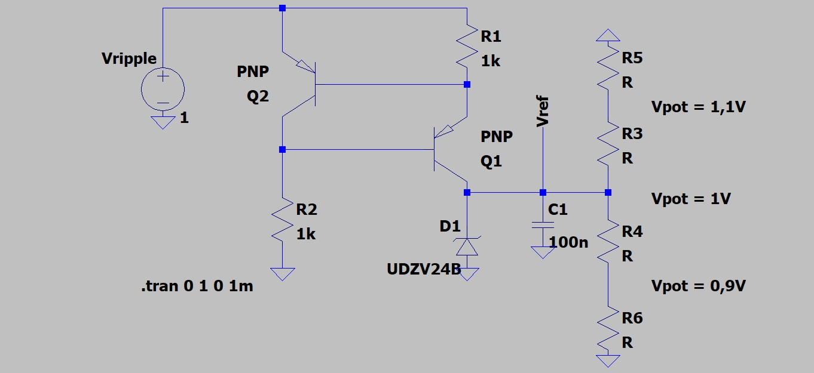
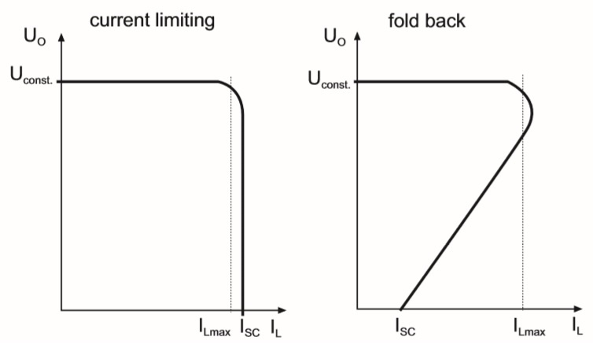
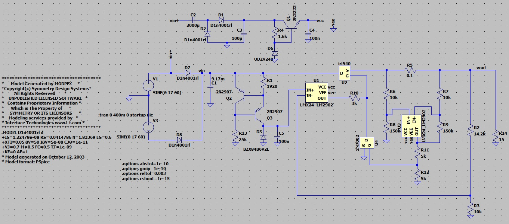
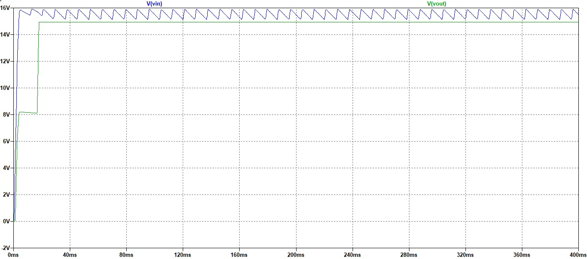
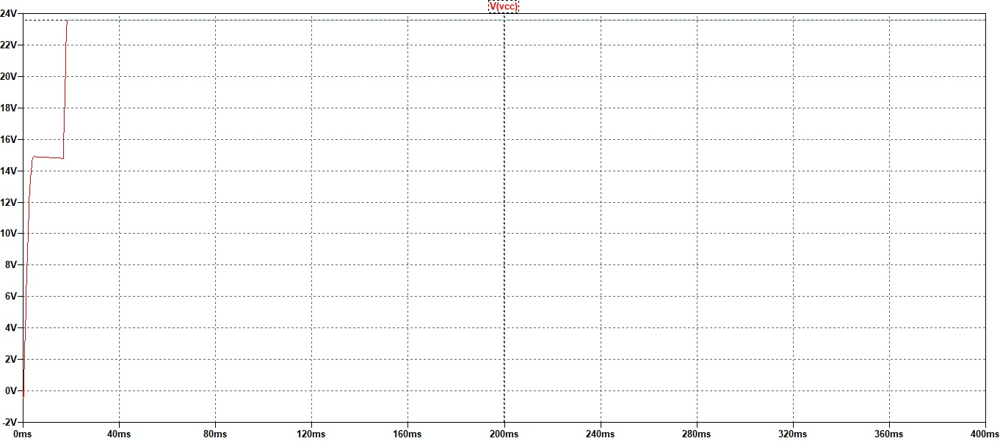
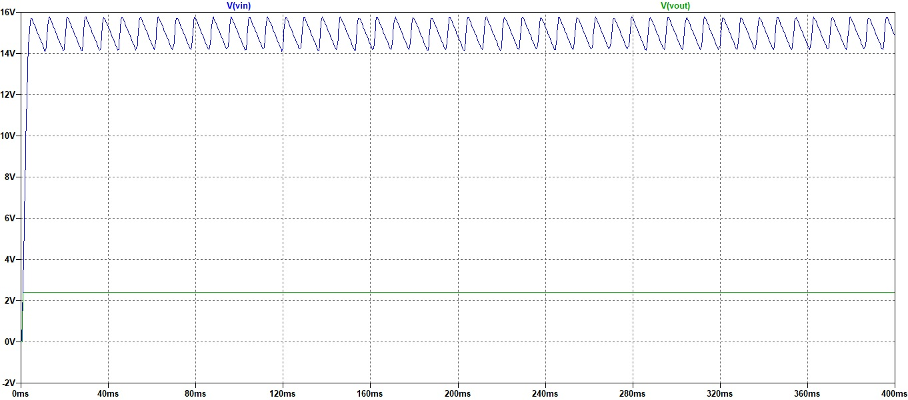

# Atividade 4
Aluno: 
* Gabriel Wagner - <gabrielstd545@gmail.com>

Professores: 
* Daniel Lohmann

## Parte 01: Entendendo um regulador linear

### Princípios de regulação de tensão
A regulação de tensão é um método em que se deseja manter a tensão de certa parte do circuito praticamente constante, mesmo na mudança de alguns aspectos desse circuito,
como tensão de entrada, valor da carga, entre outros.

### Tensão de saída
A tensão de saída após o retificador deve ser contínua, bem como continua em relação ao tempo.

### Tensão de ripple
A tensão de ripple é comumente associada a uma tensão retificada e filtrada por um capacitor. Ela é muito importante quando queremos converter uma tensão alternada em uma
tensão contínua.
Seu valor é dado pela subtração da tensão superior menos a tensão inferior, depois de filtrada e retificada.

### Regulação de linha
A regulação de linha é um importante aspecto da regulação de tensão. Quando estamos alimentando qualquer circuito, não queremos que essa tensão de alimentação varie muito.
A regulação de linha mede essa variação, comparando a variação da tensão de saída pela tensão de entrada. Dada pela fórmula:
Regulação de linha = (delta Vout) / (delta Vin)
Sendo expressada em V/V.

### Regulação de Carga
Enquanto isso, quem regula a tensão de saída quando diferentes cargas são conectadas, é o regulador de carga. O regulador de carga segue a seguinte fórmula:
Regulação de carga = (delta Vout) / (delta Iout)
Sendo expressada em V/A.

### Conceito de LDO – Low Dropout Voltage
Da forma mais básica que se pode explicar, LDO é o mínimo delta que se pode alcançar entre as tensões de entrada e saída, mantendo o funcionamento da regulação do circuito.
Essa característica é definida principalmente pela tensão VDO.
A tensão VDO, é a tensão diferencial mínima que a tensão Vin deve manter acima da tensão Vout, para uma regulação correta.
A equação que descreve esse comportamento é:

Vin >= Vout + VDO

Se Vin diminuir para um valor menor que (Vout + VDO) o regulador linear irá entrar em operação de "dropout", não regulando a tensão de saída desejada.
Nesse estado a equação que rege o regulador é:

Vout = Vin - VDO

### Parte 01.1:

Figura 1 - Parte 01.1

* Qual relação entre a tensão de alimentação do ampop e a tensão de
saída?

A tensão de saída sempre será limitada pela alimentação do ampop, bem como as limitações do próprio ampop em relação a tensão na saída, que podem restringir essa tensão
em um valor menor que as tensões de alimentação.

* O que devemos considerar para esse circuito operar como um LDO?

Utilizando a equação do LDO (Vin >= Vout + VDO) podemos discutir pontos importantes.

Vin  -> A tensão de entrada será limitada pela escolha do diodo zenner.

Vout -> A tensão de saída será limitada por questões do ampop, como explicado anteriormente(tensões de alimentação e limites na saída).

* Como obter as tensões de alimentação para o AmpOp (VCC e VEE)?

As tensões de alimentação devem apresentar valores de modo a não saturar o sinal, que é constituído pela soma da tensão de saída e a tensão VGS.

### Parte 01.2:

Figura 2 - Parte 01.2

* Utilizando o circuito dobrador de tensão, qual valor de VCC você obtêm para um sinal Vin+ de
12Vrms?

O circuito dobrador de tensão segue a seguinte fórmula:

Obs.: Consideraremos a tensão de entrada muito maior que as quedas de tensão nos diodos.

Vout = 2 * Vinpico - VD1 - VD2

Para um sinal de 12rms temos uma saída de:

Vout = (12 * raiz(2)) * 2 - 0,7 - 0,7
Vout = Aproximadamente 32 V

* Quais problemas apresentam esse circuito? Podemos melhorar?

Esse circuito apresenta ondulação devido a tensão de ripple, então deve-se tomar cuidado na escolha do capacitor, levando em conta o tempo de carga do capacitor, que será longo se o valor do capacitor for alto, e a ondulação, que será alta se o valor do capacitor for baixo.

Além disso, sabemos que a saída está em funcão de aproximadamente duas vezes a tensão de entrada, onde um surto de tensão poderá acarretar em mal funcionamento na alimentação do ampop.

Podemos melhorar o circuito fazendo o balanço correto na escolha do capacitor e além disso, podemos adicionar um regulador linear de tensão na saída do dobrador, limitando a tensão de saída que irá alimentar o ampop.
 
### Parte 01.3:

Figura 3 - Parte 01.3

* Qual a Tensão VGS? Descreva como obter o valor

A tensão VGS é a tensão gate-source do MOS, é a tensão que polariza esse transistor, possibilitando a passagem de corrente, além disso é a tensão que controla a resistência
RDS dele. Quanto maior a tensão VGS, menor a resistência RDS desse MOS.

Podemos perceber através do circuito empregado, que a tensão VGS para esse circuito, é a subtração entre a tensão de saída do ampop U1 e a tensão de saída da fonte(Vout).

Tomando a tensão de saída como 15 V, e olhando o datasheet do NMOS IR540, que para uma corrente IDS de 1 A, precisa de uma tensão VGS de 4,5 V, temos que:

Saída do ampop U1 = 4,5 + 15 = 19,5 V

Podemos arredondar para 20 V devido a quedas de tensões que podem variar no circuito.

* Qual a corrente de alimentação do AmpOp?

Olhando o datasheet do LM324, podemos verificar uma corrente de alimentação mínima de 3 mA.

* Qual a tensão de alimentação do AmpOP?

O ampop LM324 pode ser alimentado com até 32 V de alimentação única, pórem ele estará sendo alimentado com uma tensão de 24 V, oferecendo uma margem de erro. É necessária uma tensão de 20 V na saída do LM324, por esse motivo foi escolhida essa margem.

* Qual fator devo considerar para escolher o transistor Q1?

É necessário um hfe ou beta de valor alto, maior que 100. Para que a corrente que alimente a base desse bjt seja muito menor que a corrente do diodo zener.

* Qual valor da tensão do diodo zener D6?

Foi escolhida uma tensão de zener de 24 V, para que o ampop U1 receba tensão suficiente na alimentação, podendo fornecer assim, 20 V na saída.

* Como escolher o diodo zener D6, maximizando a eficiência energética e minimizando os ruídos no circuito?

A resistência de zener deve ser analisada para resolver esse problema. A corrente que atravessa o zener pode variar em algum momento, então é necessário que a resistência de zener seja baixa para que a tensão de regulação do zener não varie muito.

* Considere que, por alterações futuras no circuito, o AmpOp poderá ter uma
aumento de 10mA na corrente de alimentação, o circuito proposto continuará
funcionando?

Sim, se a corrente de alimentação for maior que a mínima corrente de alimentação o ampop continuará funcionando.

## Parte 02: Calculando e dimensionando os componentes

* Para o primeiro bloco (D1, D2 e C1) considere vin+ = 12Vrms, vripple_pós_retificador = 1V e I_carga = 1,1A. Justifique a escolha dos componentes.

Os diodos D1 e D2 devem ter uma queda de tensão menor que 1 V, para que essa queda não consuma grande parte da tensão do circuito. Além disso, ambos devem poder dissipar mais que 18,7 W de potência, sem danificar o componente. Outro problema são as correntes de pico durante o transitório, que podem aumentar a queda de tensão do diodo. O valor da corrente aumenta conforme o valor do capacitor de filtro.
Um diodo como o 1N4001 suporta grandes picos de corrente sem aumentar muito sua queda de tensão direta.

O capacitor C1 será escolhido com base no retificador de onda completa, levando em conta que o produto da capacitância e da resistência de carga são muito maiores que o período da onda. Deste modo temos que:

C = IL/(2 * f * Vr)
C = 1,1/(2 * 60 * 1)
C = 9,17 mF

 ### Parte 02.1: Circuito referência de tensão zener (R1 e D3):
 
* Quais fatores devo considerar para escolher o diodo zener para essa aplicação?

A tensão de zener deve ser suficiente para fornecer as tensões de saída. Além disso o zener deve ter valor Rz baixo para melhor regulação.

* Qual a influência da regulação de linha e da regulação de carga para este circuito?

A regulação de carga e linha vai medir a efetividade do regulador. Por esse motivo, projetamos um circuito que tenha baixa variação na tensão de saída, no melhor dos casos com regulação de linha e carga próximos de zero.

* Qual o impacto da regulação linha / carga do circuito com o diodo zener na tensão de
saída do regulador linear? 

O diodo zener estará limitando a tensão de saída, de modo que a variação de vout seja baixa, próxima de zero. Assim temos que:

Regulação de linha = (delta Vout) / (delta Vin) = (0) / (delta Vin) = 0 V/V

Então mesmo que a tensão de entrada varie, a tensão de saída variará pouco.

O mesmo ocorre para o regulador de carga, que mesmo variando a carga, a regulação permanecerá a mesma.

Regulação de carga = (delta Vout) / (delta Iout) = (0) / (delta Iout) = 0 V/A

* Podemos melhorar esse circuito? Quais problemas podemos identificar nesta topologia?

Sabendo da importância que o zener tem na tensão de saída, não queremos que correntes variantes atrapalhem sua regulação. Então uma topologia de corrente constante resolveria o problema.

* Acerca do fonte de corrente. Podemos melhorar mais ainda? Que tal deixar essa fonte com valor ajustável? Como fazer isso?

Para controlar a corrente nessa topologia, basta alterarmos o valor do resistor R1, usando por exemplo, um potenciômetro. Porém alterar o valor do resistor dimensionado pode causar aumento de ruído.

Um aspecto que pode melhorar a topologia, é adicionar um potenciômetro em paralelo com a tensão de referência na saída. E para um melhor ajuste, podemos também adicionar resistores em série com o potenciômetro, diminuindo a excursão de tensão do potenciômetro. Dessa maneira deixaremos a tensão que entra no ampop mais fixa.

A figura abaixo exemplifica o procedimento.

Figura 4 - Espelho de corrente com potenciômetro.

 ### Parte 02.2: Escolhendo o transistor M1 e calculando R2 e R3.

* Qual a corrente contínua necessária?

Para o transistor M1, foi especificado uma corrente de 1 A, sendo necessário um VGS de 4,5 V.

Enquanto que para os resistores de ganho, a corrente deve ser baixa, de modo que a carga receba corrente suficiente. Uma corrente na ordem de micro amperes é suficiente para esse exemplo.

* Quais os limites de tensão para este circuito?

As tensões que chegam nesse circuito estão limitadas pela tensão de entrada, que nesse momento estarão entre 15 e 16 V. É desejado que a tensão VDO nessa parte do circuito, que se resume nesse momento ao transistor MOS, seja a menor possível.
A tensão VGS será limitada pela saída do ampop menos a tensão de saída.
E a maior tensão aplicada nos resistores de ganho, é a tensão de saída, que para o projeto vale 15 V.

#### Ao escolher o transistor obtenha:

* Quais os os parâmetros L, W, uo, Cox, VA e Vt?

L = 100 uH

W = 100 uW

u0 = Valor Padrão = 600 cm²/V/s

C0x = KP/u0 = 41,68 mF/m²

VA = 1/LAMBDA= 1/0.00291031 = 343,61 v

Vt = 3.56362 V

* Calcule o valor de RDS para as tensões VGS de 2V, 3V, 4V, 5V e 10V

VGS(v) | Vt0(V)   | RDS teórico + (RS+RD modelo spice)(ohms) | RDS Simulação(ohms)
------ | -------  | ---------------------------------------- | -------------------
2      | 3,56362  | infinito | 4 Mega
3      | 3,56362  | infinito | 4 Mega
4      | 3,56362  | 0,137 | 0,156
5      | 3,56362  | 0,073 | 0,074
10     | 3,56362  | 0,051 | 0,051

* Quais as tensões máximas de operação deste componente?

A tensão VGS do IR540 não pode exceder +-20 V, enquanto que sua tensão VDS não pode exceder 100 v.

* Obtenha as curvas ID x VDS para esse componente para as tensões VGS de 2V, 3V, 4V, 5V e 10V e compare os resultados com as curvas presentes no Datasheet.

A simulação está de acordo com os valores do datasheet.

* Qual o valor da capacitância de gate?

CGS = Ciss - Crss = 1700p - 120p = 1580 pF típico.

Justifique a escolha dos resistores R2 e R3.

Foi escolhido um zener(D3) com tensão de zener de 6,2V com RZ valendo 10 ohms. Devemos levar em conta que necessitamos de uma tensão por volta de 15 V na saída. Por esse motivo, optei por resistores na ordem de quilo-ohms oferecendo uma corrente maior na saída, com um ganho no ampop de (1+(14,2k/10k)) V/V.

## Parte 03

### Parte 03.1 Adicionando um circuito de proteção de sobre corrente ao regulador linear.

* Primeiramente reflita e pesquise sobre o que é sobrecorrente? Quais os impactos neste circuito?

Excesso de corrente que ultrapassa valores nominais calculados no projeto. Possibilidade de queima de componentes do circuito, bem como excesso de corrente na carga, gerando possível queima e mal funcionamento.

* O que deve fazer um circuito de proteção de sobrecorrente?

Proteger carga e circuito, enquanto durar a sobrecorrente. 

* O que é a proteção foldback?

Quando um circuito está sendo alimentado em sobre-corrente, proteções normais tendem a diminuir a tensão até zero, porém elas mantém a corrente constante, dissipando grandes valores de potência nos componentes. O circuito com proteção de foldback surge para resolver esse problema.

Figura 5 - Proteção Foldback.

Referência: Training Texas; Fórum Training Texas; https://e2e.ti.com/support/power-management/f/power-management-forum/474341/tps54620-over-current-protection-foldback

Olhando a curva da tensão de saída x corrente de saída durante a sobrecorrente, percebe-se como é importante a atuação da proteção foldback, que diminui correntes e tensões quase linearmente.

Pesquise as topologias disponíveis, caso deseja-se fazer um circuito LDO, o o que devemos levar em consideração para o regulador?

Devido a condições externas e cenários inesperados, o LDO pode sofrer com uma corrente mais elevada, podendo danificar partes mais sensíveis do circuito, bem como gasto excessivo de energia. A proteção contra esse tipo de problema é muito importante para um LDO. Levando isso em consideração, podemos exemplificar esses circuitos com dois tipos muito usados de proteção. A proteção foldback citada acima e a proteção "brick-wall".

A proteção "brick-wall", coloca um limite superior para a corrente fornecida pelo LDO. Quando esse limite é atingido, a saída para de ser regulada e é limitada por:

V(out) = I(limite) * R(carga)

O transistor próximo a saída, continuará dissipando potência desde que não ultrapasse a temperatua máxima da sua junção. Caso isso aconteça, um circuito de desligamento forçado por temperatura entra em ação.

Um exemplo de LDO que segue essa topologia, é o TPS7A16 da Texas Instruments.
Referência: Texas Instruments; https://www.ti.com/product/TPS7A16

A proteção foldback, da mesma maneira que a proteção "brick-wall", coloca um limite superior para a proteção contra sobrecorrente, seu principal objetivo é diminuir a corrente linearmente com a tensão de saída, deixando a tensão de entrada constante, diminuindo a potência dissipada em cima do transistor de saída. Nessa topologia não há a necessidade de um circuito de desligamento forçado por temperatura.
Temos como exemplo de um LDO com foldback o TLV717P da Texas Instruments.
Referência: Texas Instruments; https://www.ti.com/product/TLV717P

## Parte 04 - Simulação

Figura 6 - Circuito LTSpice.

Figura 7 - Tensão Vin x Vout.

Figura 8 - Tensão de alimentação dos ampops.

Figura 9 - Tensão Vin x Vout. Simulando a sobrecorrente.

