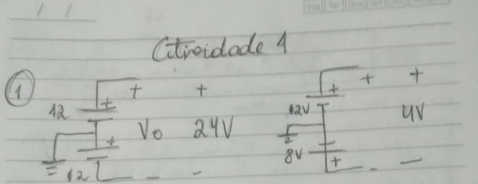
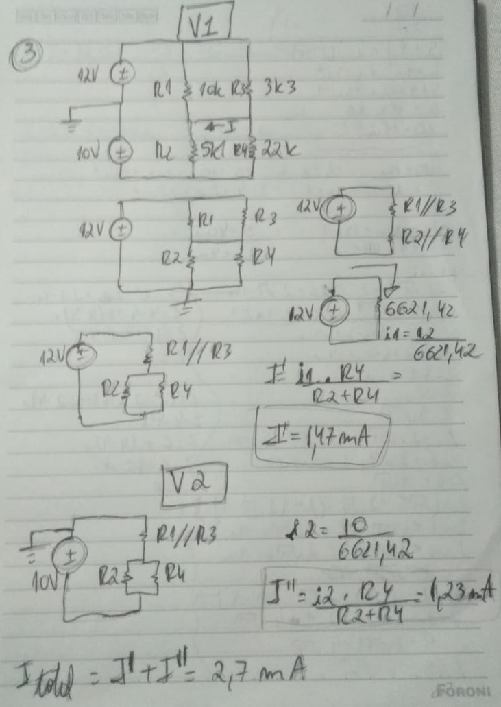

# Atividade 1
Aluno: 
* Gabriel Wagner - <gabrielstd545@gmail.com>

Professores: 
* Daniel Lohmann

## Exercício 1

Figura 1 - Exercício 1

## Exercicio 2

Para  escobrirmos a tensão V0, basta encontrar a tensão em R2 e depois somar com a tensão da fonte V2.

Figura 2 - Exercício 2

## Exercício 3

Para calcularmos a corrente que passa por R2, aplicaremos o teorema da superposição.
Fazendo a série entre o paralelo de R1 e R3, e o paralelo de R2 e R4 podemos encontrar a corrente.
Depois disso basta fazer o caminho inverso separando R2 e R4, e por fim calcular a corrente através do divisor de corrente. Deste modo encontraremos a corrente para as duas fontes.

Figura 3 - Exercício 3

## Exercício 4

Para calcular a queda de tensão em R3, temos que encontrar a corrente que passa por essa malha. Para encontrar essa corrente, temos que encontrar o valor da corrente na fonte dependente.
A corrente na fonte dependente será o ganho Gm vezes a queda de tensão no resistor R2.
Para encontrarmos a queda de tensão no resistor R2 basta fazermos um divisor de tensão entre R2 e R1.

Figura 4 - Exercício 4

