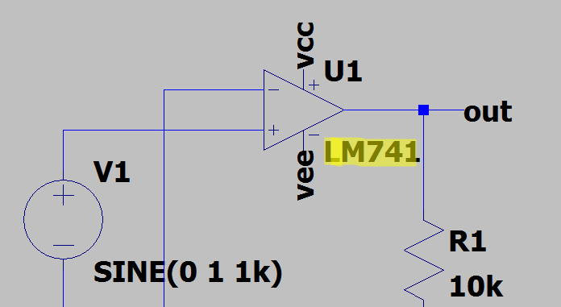
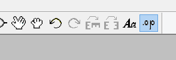
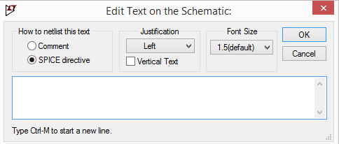
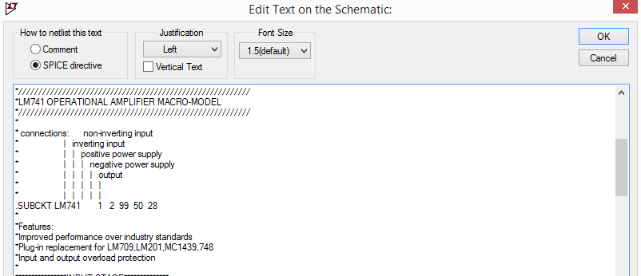
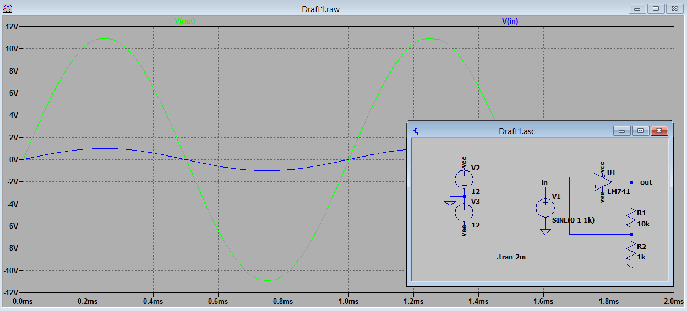
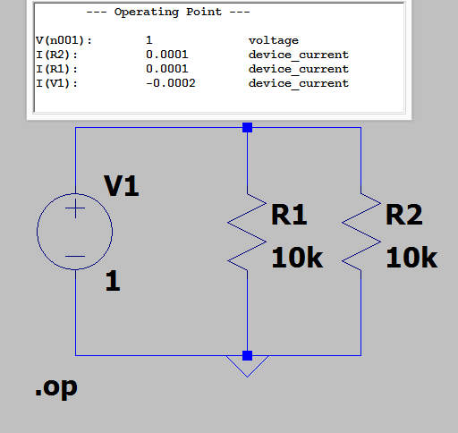

# Netlist

Netilist é uma descrição de componentes e suas conexões. Um circuito é descrito por um Netlist será descrito por meio de seus nós, componentes e pela maneira que nós e componentes estão conectados.

## Label 

Label é um palavra usada pra identificar um elemento, seja ele um nó ou componente no Netlist. É possivel renomear uma label para facilitar a compreensão na hora de ler o Netlist.
    
## Componente
    
Os componentes basicos implementados no SPICE são resistor, capacitor e indutor e um SUBCKT. 

Cada componente é representado por uma Label e um valor no script, como por exemplo, a letra R representa um resistor é o 10k representa o valor da resistência: 

## SUBCKT
    
Representado por padrão com a  letra U no netlist, o SUBCKT é uma abstração de um conjunto de componentes e suas ligações.

## Como incluir novos modelos

É possivel renomear um modelo genérico de um componente, com o nome de um SUBCKT fazendo esse adquirir as caracteristicas descritas pelo SUBCKT.  

Neste exemplo é utilizado o modelo opamp2 renomeado LM741:

A inserção do modelo feita por meio de uma diretiva SPICE clicando no botão:

Depois de clicar, a seguinte janela aparece:

na caixa de texto eh possivel colocar o NETLIST do nosso modelo SPICE fornecido pelo fabricante 

ou ainda é possivel incluir o modelo SPICE desejado na pasta 
"[...]LTC\LTspiceXVII\lib\sub" do ltspice

sendo necessario apenas a diretiva 

>.lib LM741.lib

para incluir o modelo ao projeto.
# Simulação SPICE

## Transiente
    
Usada para analizar eventos variantes no tempo como transitórios. Representada pela diretiva 

>.tran 

## *DC operating point*
    
Análise em corente contínua, onde são mostradas tensões e correntes nodais.

## *DC sweep*

Usada para variar tensões em fontes de corrente contínua.

## .step
    
Usado para variar parametros num determinado intervalo. Pode ser utilizado para avaliar o comportamento do circuito para diferentes cargas.

## .means
    
Obtem a medida no momento especificado.

## Simulando um circuito em diferentes temperaturas
    
A simulação de circuitos em faixas de temperaturas é feita utilizando a diretiva .step variando o parametro temp.

